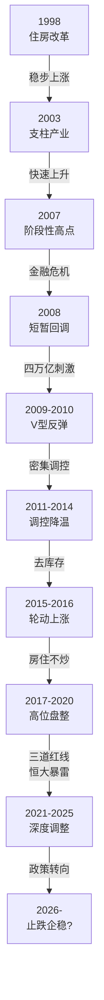
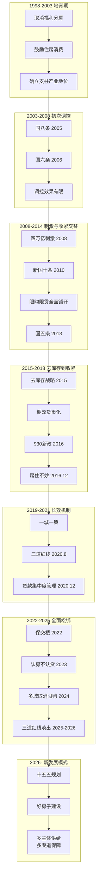
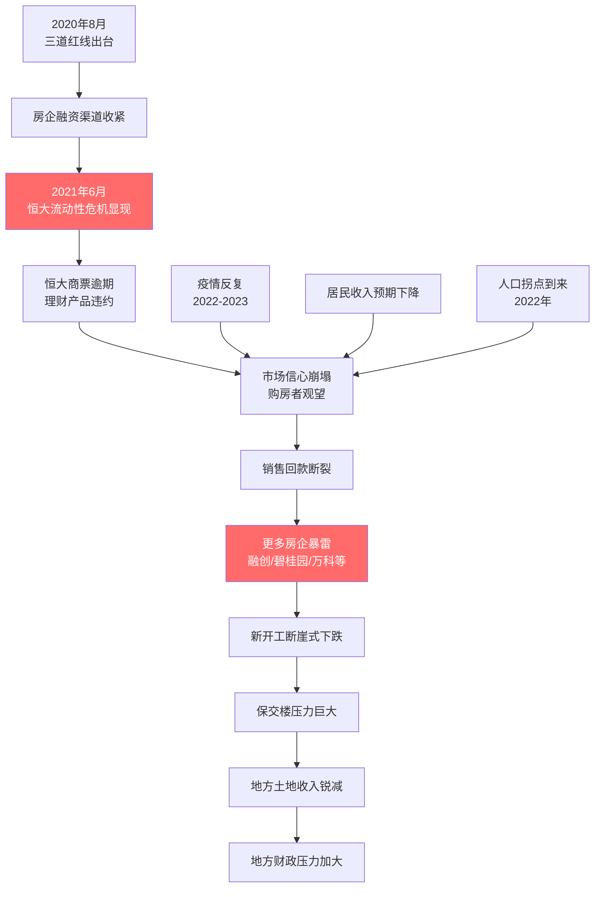
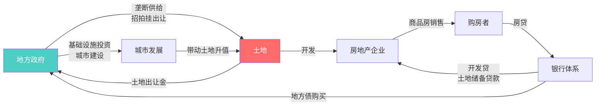
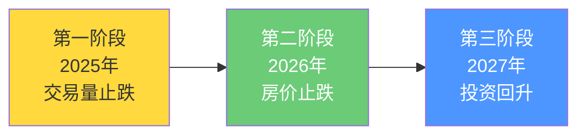

+++
date = '2026-03-25T22:40:48+01:00'
draft = false
title = '中国房价发展趋势调研报告'
+++


> 报告日期：2026年3月
>
> 摘要：本报告系统梳理了中国房地产市场自1978年改革开放以来的发展历程，深入分析房价变动的核心驱动因素、政策调控演变脉络、城市分化格局，并结合"十五五"规划与最新市场数据，展望未来发展趋势。

---

## 目录

1. [中国房地产市场发展历史阶段](#1-中国房地产市场发展历史阶段)
2. [房价核心驱动因素分析](#2-房价核心驱动因素分析)
3. [房地产调控政策演变](#3-房地产调控政策演变)
4. [城市分化格局](#4-城市分化格局)
5. [2021-2025年：深度调整期全景分析](#5-2021-2025年深度调整期全景分析)
6. [土地财政与地方债务](#6-土地财政与地方债务)
7. [国际比较与经验借鉴](#7-国际比较与经验借鉴)
8. [2026年及中长期趋势展望](#8-2026年及中长期趋势展望)
9. [风险提示与建议](#9-风险提示与建议)
10. [总结](#10-总结)

---

## 1. 中国房地产市场发展历史阶段

中国房地产市场的发展与国家经济体制改革深度交织，大致可划分为以下几个关键阶段：

### 1.1 历史阶段总览

```
┌─────────────────────────────────────────────────────────────────────────────┐
│                    中国房地产市场发展阶段总览                                  │
├──────────────┬──────────────────────────────────────────────────────────────┤
│ 1978-1988    │ 萌芽探索期：住房制度改革启动                                   │
│ 1988-1998    │ 起步发展期：市场化初步尝试                                     │
│ 1998-2003    │ 市场化元年：住房分配货币化改革                                  │
│ 2003-2008    │ 快速上升期：黄金时代开启                                       │
│ 2008-2014    │ 刺激与调控交替期：四万亿与限购时代                               │
│ 2015-2018    │ 去库存与棚改货币化：三四线城市房价飙升                            │
│ 2018-2020    │ 房住不炒：长效机制建立                                         │
│ 2021-2025    │ 深度调整期：房企暴雷与市场下行                                  │
│ 2026-        │ 新发展模式构建期：止跌企稳与结构转型                             │
└──────────────┴──────────────────────────────────────────────────────────────┘
```

### 1.2 各阶段详细分析

#### 第一阶段：萌芽探索期（1978-1988）

- **背景**：改革开放前，中国实行福利分房制度，城镇居民住房由单位统一分配，住房严重短缺
- **标志性事件**：
  - 1978年，邓小平提出"解决住房问题能不能路子宽些"，揭开住房制度改革序幕
  - 1979-1982年，中央政府开始在部分城市试点商品房建设
  - 1988年，国务院颁布《在全国城镇分期分批推行住房制度改革实施方案的通知》
- **房价特征**：尚不存在真正意义上的商品房市场，住房以实物分配为主

#### 第二阶段：起步发展期（1988-1998）

- **背景**：住房商品化理念逐步确立，但福利分房制度仍然存在
- **标志性事件**：
  - 1990年，上海开始土地使用权有偿出让试点
  - 1992年，海南房地产泡沫兴起，随后在1993年破裂，成为中国房地产市场第一次大规模泡沫经验
  - 1994年分税制改革，地方财权上收，为后续"土地财政"模式埋下伏笔
- **房价特征**：局部地区出现投机性上涨（如海南、北海），但全国性商品房市场尚未形成

#### 第三阶段：市场化元年（1998-2003）

- **背景**：亚洲金融危机冲击下，政府需要新的经济增长引擎
- **标志性事件**：
  - **1998年7月**，国务院颁布《关于进一步深化城镇住房制度改革加快住房建设的通知》（国发[1998]23号文），**全面停止住房实物分配，实行住房分配货币化**，这是中国房地产市场化的里程碑
  - 1998年5月，央行出台《个人住房贷款管理办法》，确立30%首付比例和最长20年贷款期限
  - 2003年，国务院18号文明确房地产为国民经济支柱产业
- **房价特征**：全国房价开始稳步上涨，商品房市场框架初步建立

#### 第四阶段：快速上升期（2003-2008）

- **背景**：中国加入WTO后经济高速增长，城镇化加速推进
- **核心特征**：
  - 城镇化率从2003年的40.5%提升至2008年的46.9%
  - 大量农村人口进城，住房需求集中释放
  - 投资性购房需求开始显现
  - 2007年全国房价同比涨幅达到14.8%
- **政策应对**：2005年"国八条"、2006年"国六条"出台调控，但效果有限

#### 第五阶段：刺激与调控交替期（2008-2014）

- **背景**：全球金融危机冲击，经济下行压力巨大
- **核心特征**：
  - 2008年底"四万亿"经济刺激计划出台，房地产市场V型反弹
  - 2009年房价飙升，一线城市涨幅超过50%
  - 2010年-2014年密集调控：限购、限贷、限价政策相继出台
  - "新国十条"（2010）成为史上最严厉调控政策之一
- **房价特征**：整体呈现"刺激-暴涨-调控-回落-再刺激"的周期性波动

#### 第六阶段：去库存与棚改货币化（2015-2018）

- **背景**：三四线城市库存高企，经济面临下行压力
- **核心特征**：
  - 2015年中央提出房地产"去库存"战略
  - 棚改货币化安置大规模推进，直接推升三四线城市房价
  - 一线城市房价在2015-2016年再次暴涨（深圳涨幅超60%）
  - 2016年"930"新政后，热点城市密集出台调控措施
- **房价特征**：轮动上涨——一线城市率先上涨，随后传导至二线、三四线城市

#### 第七阶段：房住不炒与长效机制（2018-2020）

- **背景**：2016年12月中央经济工作会议首次提出"房住不炒"定位
- **核心特征**：
  - "房住不炒"成为此后数年的政策总基调
  - 建立"一城一策"差异化调控机制
  - 2020年8月出台房企融资"三道红线"（剔除预收款后的资产负债率不超过70%、净负债率不超过100%、现金短债比不小于1倍）
  - 2020年12月出台银行房地产贷款集中度管理制度
- **房价特征**：热点城市房价高位运行，但涨幅趋缓

#### 第八阶段：深度调整期（2021-2025）

- **背景**：多重调控政策叠加效应显现，叠加疫情冲击
- **核心特征**：（详见第5章深度分析）
  - 2021年下半年恒大债务危机爆发，引发行业连锁反应
  - 2022-2025年全国房价持续下行
  - 2025年全国房地产开发投资82,788亿元，同比下降17.2%
- **房价特征**：全面下行，量价齐跌

### 1.3 房价走势周期图



---

## 2. 房价核心驱动因素分析

中国房价的变动是多重因素交织作用的结果，以下从供需两端及宏观环境进行系统分析。

### 2.1 驱动因素体系框架

```
                        ┌──────────────────────┐
                        │    中国房价驱动因素     │
                        └──────────┬───────────┘
              ┌────────────────────┼───────────────────┐
              ▼                    ▼                    ▼
     ┌────────────────┐  ┌────────────────┐  ┌────────────────┐
     │    需求端因素    │  │    供给端因素    │  │  宏观环境因素    │
     └───────┬────────┘  └───────┬────────┘  └───────┬────────┘
             │                   │                    │
     ┌───────┼────────┐  ┌──────┼───────┐   ┌───────┼────────┐
     │       │        │  │      │       │   │       │        │
     ▼       ▼        ▼  ▼      ▼       ▼   ▼       ▼        ▼
  人口     城镇化   居民   土地   开发    库存  货币   财政    国际
  结构     进程    收入   供给   投资    水平  政策   政策    环境
                  与预期
```

### 2.2 需求端因素

#### （1）人口结构变化

| 指标 | 数据 | 对房价影响 |
|------|------|-----------|
| 总人口 | 2022年起负增长，2025年约14.0亿 | 长期需求收缩 |
| 出生率 | 2025年约6.8‰，持续走低 | 新增刚需减少 |
| 结婚登记对数 | 从2013年的1347万对降至2025年约680万对 | 婚房需求大幅下降 |
| 老龄化率 | 2025年65岁以上人口占比超15% | 养老地产需求上升，但总需求下降 |
| 家庭小型化 | 户均人口从2000年的3.44降至2025年约2.6 | 一定程度增加户数需求 |

**关键判断**：人口因素已从过去的"正向驱动力"转变为"长期抑制力"，尤其对三四线城市影响显著。

#### （2）城镇化进程

- 2024年常住人口城镇化率约67%，户籍人口城镇化率不足50%
- "两率差"约17个百分点，意味着仍有超2亿"半城镇化"人口
- 城镇化速度从高峰期的每年1.5个百分点放缓至每年不足0.8个百分点
- 城镇化的"增量红利"正在消退，但"质量提升"仍带来结构性需求

#### （3）居民收入与购买力

- 房价收入比：一线城市普遍超过30倍（深圳曾超40倍），远超国际合理水平（3-6倍）
- 居民杠杆率：从2008年的18%升至2025年的约62%，加杠杆空间有限
- 收入预期：经济增速放缓背景下，居民收入增长预期趋于谨慎

### 2.3 供给端因素

#### （1）土地供给

- 土地供给由地方政府垄断，实行"招拍挂"制度
- 2021年起实施集中供地（"两集中"）政策，后逐步调整
- 2023-2025年土地出让面积大幅下降，2025年全国土地出让收入约3.7万亿，较2021年高点（8.7万亿）腰斩

#### （2）房地产开发投资

- 2025年全国房地产开发投资82,788亿元，同比下降17.2%
- 新开工面积持续萎缩，较2019年高点下降超60%
- 房企投资意愿低迷，行业进入"缩表求生"模式

#### （3）库存水平

- 截至2025年末，全国商品住宅待售面积仍处高位
- 一线城市去化周期12-18个月，部分三四线城市超36个月
- "保交楼"任务仍然艰巨

### 2.4 宏观环境因素

#### （1）货币政策与利率

- M2增速与房价存在显著正相关关系（相关系数约0.65）
- 5年期以上LPR从2019年的4.85%持续下调至2025年末的3.6%左右
- 首套房贷利率在部分城市已降至3%以下
- 宽松货币环境为房价提供支撑，但传导效率下降

#### （2）财政与税收政策

- 契税、增值税等交易环节税费多次调整
- 房地产税立法推进缓慢，短期内全面落地可能性较低
- 专项债用于收购存量商品房作保障房，成为新的政策工具

---

## 3. 房地产调控政策演变

### 3.1 政策演变脉络



### 3.2 重大调控政策汇总表

| 时间 | 政策名称/内容 | 方向 | 核心影响 |
|------|-------------|------|---------|
| 1998年 | 23号文 | 刺激 | 全面停止福利分房，开启市场化 |
| 2003年 | 18号文 | 刺激 | 确立房地产支柱产业地位 |
| 2005年 | 国八条 | 收紧 | 首次从中央层面系统性调控 |
| 2008年 | 四万亿刺激 | 刺激 | 房贷利率7折优惠，首付降至20% |
| 2010年 | 新国十条 | 收紧 | 限购令全面推出，二套房首付50% |
| 2013年 | 国五条 | 收紧 | 二手房交易征收20%个税 |
| 2015年 | 去库存、330新政 | 刺激 | 二套房首付降至40%，营业税免征期缩短 |
| 2016年 | 930新政 | 收紧 | 20余城密集出台限购限贷 |
| 2016年12月 | "房住不炒"提出 | 定调 | 确立此后数年政策总基调 |
| 2020年8月 | 三道红线 | 收紧 | 房企融资监管，限制有息负债增速 |
| 2020年12月 | 贷款集中度管理 | 收紧 | 限制银行房地产贷款占比上限 |
| 2022年7月 | 保交楼 | 托底 | 专项借款支持问题楼盘交付 |
| 2023年8月 | 认房不认贷 | 放松 | 一线城市跟进，降低置换门槛 |
| 2024年 | 多城取消限购 | 放松 | 除北上深外基本全面取消 |
| 2025-2026年 | 三道红线淡出 | 放松 | 融资限制松绑，政策180度转弯 |
| 2026年 | 十五五规划 | 转型 | 构建房地产发展新模式 |

### 3.3 调控政策工具箱

```
┌──────────────────────────────────────────────────────────────┐
│                     房地产调控工具箱                           │
├──────────────┬──────────────┬──────────────┬────────────────┤
│   需求端工具   │   供给端工具   │   金融端工具   │  财税端工具     │
├──────────────┼──────────────┼──────────────┼────────────────┤
│ · 限购政策    │ · 土地供给    │ · 房贷利率    │ · 契税调整      │
│ · 限售政策    │ · 集中供地    │ · 首付比例    │ · 增值税调整    │
│ · 购房资格    │ · 保障房建设   │ · 三道红线    │ · 个税政策      │
│ · 户籍关联    │ · 城市更新    │ · 贷款集中度  │ · 土地增值税    │
│ · 社保年限    │ · 收储存量房   │ · 公积金政策  │ · 房地产税（待） │
│ · 限价政策    │ · 好房子标准   │ · 开发贷管理  │ · 专项债收储    │
└──────────────┴──────────────┴──────────────┴────────────────┘
```

---

## 4. 城市分化格局

### 4.1 分化趋势总览

中国房地产市场正呈现日益显著的**"二八分化"**格局，约20%的城市因人口流入、产业集聚逐步触底企稳，而大多数三四线城市则面临人口流出、进入漫长的调整期。

### 4.2 一线城市（北京、上海、广州、深圳）

**2026年2月最新数据**：
- 北京、上海新建住宅价格环比微涨，市场企稳信号明显
- 一线城市二手房交易量在2025年下半年出现复苏，价格降幅收窄
- 2025年12月，一线城市二手住宅销售价格同比仍下降7.0%，但环比跌幅已显著收窄
- 广深楼市从全面下跌转向局部结构性分化

**核心特征**：
- 人口持续净流入，产业基础雄厚
- 核心区域房价韧性强，郊区承压
- 改善性需求成为主要驱动力
- 预计率先企稳回升

### 4.3 二线城市

**2026年2月数据**：
- 二手住宅价格环比下降0.4%，降幅收窄0.1个百分点
- 内部分化加剧：杭州、成都、西安等强二线城市表现较好，部分弱二线城市仍在寻底

**核心特征**：
- 成都等城市已取消限购，市场活跃度提升
- 强省会城市受益于人口虹吸效应
- 产业转型成功的城市房价支撑力更强

### 4.4 三四线城市

**现状与挑战**：
- 二手住宅价格环比下降0.5%，跌幅收窄但仍在下行通道
- 大多数三四线城市面临人口净流出
- 棚改货币化退潮后，前期透支的需求难以为继
- 部分城市去化周期超过36个月

### 4.5 城市分化示意图

```
                    房价韧性/恢复速度
                         ▲
                         │
                 强 ─────┼──────────── 高
                         │
         ●北京  ●上海    │    ●杭州
                         │  ●成都 ●西安
              ●深圳      │
         ●广州           │     ●南京 ●武汉
                         │
         ────────────────┼────────────────── 人口流入强度
                         │
                         │  ●郑州  ●天津
                         │     ●昆明
                         │
                         │      ●洛阳 ●烟台
                         │  ●湛江
                 弱 ─────┼──────────── 低
                         │
                    三四线城市群
```

---

## 5. 2021-2025年：深度调整期全景分析

### 5.1 调整触发链条



### 5.2 关键数据回顾

| 指标 | 2021年 | 2022年 | 2023年 | 2024年 | 2025年 |
|------|--------|--------|--------|--------|--------|
| 商品房销售面积（亿㎡） | 17.94 | 13.58 | 11.17 | ~9.7 | ~8.5（估） |
| 商品房销售额（万亿元） | 18.19 | 13.33 | 11.66 | ~9.7 | ~8.6（估） |
| 房地产开发投资（万亿元） | 14.76 | 13.29 | 11.09 | ~10.0 | 8.28 |
| 开发投资同比增速 | +4.4% | -10.0% | -9.6% | ~-10% | -17.2% |
| 70城新房价格同比 | +2.6% | -2.3% | -1.1% | ~-5% | ~-5%（估） |

### 5.3 房企暴雷时间线

```
2021.06  恒大流动性危机显现
    │
2021.09  花样年违约
    │
2021.10  新力控股暴雷
    │
2021.12  恒大正式违约
    │
2022.05  融创中国债务违约
    │
2022.07  多地烂尾楼业主集体停贷
    │
2022.11  碧桂园出现流动性压力
    │
2023.08  碧桂园债务违约
    │
2023.10  远洋集团违约
    │
2024.03  万科债务危机显现
    │
2024-25  行业持续出清
    │
2025.09  恒大港股摘牌下市
```

### 5.4 政策救市历程

2022年以来，政策基调从"收紧"全面转向"托底"和"放松"：

1. **保交楼**（2022年7月）：设立专项借款，确保已售期房交付
2. **金融16条**（2022年11月）：支持房企合理融资需求
3. **三支箭**（2022年11月）：信贷、债券、股权三渠道支持房企融资
4. **认房不认贷**（2023年8-9月）：一线城市全面跟进，降低置换购房门槛
5. **多城取消限购**（2024年）：截至2024年底，除北上深及海南部分城市外，限购基本全面取消
6. **下调首付比例**（2024年）：首套房首付降至15%，为历史最低
7. **降低房贷利率**（2024-2025年）：5年期以上LPR多次下调，部分城市首套利率降至3%以下
8. **收储存量房**（2024-2025年）：地方政府利用专项债收购存量商品房用于保障房
9. **三道红线淡出**（2025-2026年）：融资"三道红线"政策已无实施意义，实质性松绑
10. **调控全面转弯**（2025年9月）：房地产调控完成180度大转弯

---

## 6. 土地财政与地方债务

### 6.1 土地财政运作机制



### 6.2 土地财政困境

- **高峰期**（2021年）：全国土地出让收入约8.7万亿元，占地方财政收入比重约40%
- **现状**（2025年）：土地出让收入降至约3.7万亿元，较高峰腰斩
- **影响链条**：房价下跌 → 房企拿地意愿下降 → 土地流拍增加 → 地方收入锐减 → 基础设施投资放缓 → 区域经济承压

### 6.3 地方债务风险

- 截至2025年末，全国地方政府显性债务余额超过40万亿元
- 隐性债务（城投平台等）规模更为庞大
- 中央推动大规模化债计划（10万亿+化债方案）
- 土地财政向"后土地财政"时代转型势在必行

### 6.4 转型方向

```
            土地财政 ──────────────────────> 后土地财政

   ┌─────────────────┐            ┌─────────────────────┐
   │  旧模式           │            │  新模式               │
   │                   │            │                       │
   │  · 卖地收入为主    │    转型     │  · 房地产税（远期）    │
   │  · 高周转开发      │  ───────>  │  · 存量资产运营        │
   │  · 增量扩张        │            │  · 消费税下划          │
   │  · 土地抵押融资    │            │  · 多元化财政来源      │
   │  · 城投平台举债    │            │  · 化解存量债务        │
   └─────────────────┘            └─────────────────────┘
```

---

## 7. 国际比较与经验借鉴

### 7.1 全球主要房地产泡沫案例

| 国家/地区 | 泡沫期 | 下跌幅度 | 调整时长 | 关键教训 |
|-----------|--------|---------|---------|---------|
| 日本 | 1985-1991 | 高峰跌幅超60% | 20年+ | 货币宽松+信贷扩张+资产泡沫的恶性循环 |
| 美国 | 2003-2006 | 约33% | 5-6年 | 次贷危机：金融创新过度、监管缺失 |
| 西班牙 | 2000-2007 | 约35% | 8年+ | 过度依赖建筑业、移民涌入后退潮 |
| 中国香港 | 1997 | 约65% | 6年 | 亚洲金融危机冲击+高杠杆 |

### 7.2 中国与日本对比

```
         中国 (2021-)              日本 (1991-)
    ┌──────────────────┐     ┌──────────────────┐
    │ 相似点：            │     │ 相似点：            │
    │ · 人口拐点          │     │ · 人口老龄化        │
    │ · 房价收入比畸高     │     │ · 资产泡沫破裂      │
    │ · 居民杠杆率较高     │     │ · 企业资产负债表衰退 │
    │ · 地方政府债务       │     │ · 银行不良资产      │
    ├──────────────────┤     ├──────────────────┤
    │ 不同点：            │     │ 不同点：            │
    │ · 城镇化率仍有空间   │     │ · 城镇化已完成      │
    │ · 政府调控能力更强   │     │ · 广场协议被动升值   │
    │ · 人均GDP仍有增长    │     │ · 泡沫期涨幅更大    │
    │ · 资本账户未完全开放 │     │ · 金融自由化更彻底   │
    │ · 主动调控挤泡沫     │     │ · 被动刺破泡沫      │
    └──────────────────┘     └──────────────────┘
```

### 7.3 关键启示

1. **日本教训**：泡沫破裂后的资产负债表衰退可能持续数十年，需防止"失去的二十年"
2. **美国经验**：快速出清不良资产（如TARP计划）有助于缩短调整周期
3. **中国特殊性**：政府对经济的调控能力更强，资本管制提供缓冲，但人口结构恶化速度更快

---

## 8. 2026年及中长期趋势展望

### 8.1 2026年短期展望

#### 市场总量预测

根据中指研究院、瑞银、高盛等多家机构预测：

- **新建商品房销售面积**：预计同比下降约6%，降幅较2025年收窄
- **房价走势**：全国房价预计在2026年初步企稳（瑞银预测较此前提前半年）
- **投资**：预计2027年房地产投资可能出现企稳回升

#### "三阶段"修复路径



#### 城市分化预判

| 城市类型 | 2026年预期 | 关键驱动 |
|---------|-----------|---------|
| 一线城市 | 核心区企稳，郊区分化 | 人口流入、政策支持、改善需求 |
| 强二线城市 | 逐步触底，局部回暖 | 产业升级、人才引进、政策松绑 |
| 弱二线城市 | 仍在筑底过程中 | 去化压力大，需时间消化库存 |
| 三四线城市 | 多数继续下行 | 人口流出、需求不足、供给过剩 |

### 8.2 "十五五"中长期展望（2026-2030）

#### 核心政策方向

2026年全国两会发布的"十五五"规划纲要明确提出：

1. **加快构建房地产发展新模式**
2. **健全多主体供给、多渠道保障、租购并举的住房制度**
3. **推动"好房子"建设**——安全、舒适、绿色、智慧
4. **实现更高水平的住有所居**

#### 新发展模式框架

```
                 ┌───────────────────────────┐
                 │   房地产发展新模式            │
                 └─────────────┬─────────────┘
          ┌────────────────────┼────────────────────┐
          ▼                    ▼                     ▼
   ┌──────────────┐    ┌──────────────┐     ┌──────────────┐
   │  供给侧改革    │    │  需求侧优化    │     │  制度性建设    │
   ├──────────────┤    ├──────────────┤     ├──────────────┤
   │ · 好房子标准   │    │ · 刚需保障     │     │ · 租购并举     │
   │ · 绿色建筑     │    │ · 改善性需求   │     │ · 保障房体系   │
   │ · 智慧住宅     │    │ · 适老化改造   │     │ · 房地产税推进 │
   │ · 城市更新     │    │ · 城中村改造   │     │ · 预售制改革   │
   │ · 品质竞争     │    │ · 新市民住房   │     │ · 土地制度改革 │
   └──────────────┘    └──────────────┘     └──────────────┘
```

#### 中长期供需格局

```
        供给                               需求
   ┌──────────┐                      ┌──────────┐
   │ 新开工持续 │                      │ 人口下降   │
   │ 低位运行   │ ──> 供需再平衡 <── │ 抑制总需求 │
   │           │                      │           │
   │ 房企出清   │                      │ 城镇化     │
   │ 行业集中度 │      预计           │ 质量提升   │
   │ 提升      │    2027-2028       │ 释放增量   │
   │           │      逐步          │           │
   │ 存量房市场 │      实现          │ 改善需求   │
   │ 崛起      │                      │ 持续释放   │
   └──────────┘                      └──────────┘
```

### 8.3 长期趋势判断

1. **总量见顶，结构分化**：全国商品房销售面积难回2021年高点（17.9亿㎡），但核心城市仍有结构性机会
2. **从增量时代到存量时代**：二手房交易占比将持续提升，存量房翻新、城市更新成为新增长点
3. **从"有没有"到"好不好"**：住房消费升级，品质竞争取代规模竞争
4. **租赁市场发展**：保障性租赁住房、长租公寓市场将获得更多政策支持
5. **房地产金融属性弱化**：投资属性淡化，居住属性回归
6. **行业集中度提升**：优质房企市占率提升，行业格局重塑

---

## 9. 风险提示与建议

### 9.1 主要风险点

```
┌──────────────────────────────────────────────────────────────┐
│                        风险矩阵                               │
├──────────────────┬─────────────┬─────────────────────────────┤
│     风险类型      │   概率评估   │          主要表现            │
├──────────────────┼─────────────┼─────────────────────────────┤
│ 人口持续下降      │    高       │ 需求端长期萎缩               │
│ 房企继续暴雷      │    中       │ 信用风险传导至金融体系        │
│ 地方债务风险      │    中高      │ 土地收入锐减+化债压力        │
│ 居民消费信心不足  │    中高      │ 购房意愿低迷，政策传导不畅    │
│ 国际经济环境恶化  │    中       │ 贸易摩擦、资本外流压力        │
│ 三四线城市塌陷    │    高       │ 人口流出+库存高企+经济承压    │
│ 房地产税冲击      │    低（短期）│ 若推出可能进一步压制需求      │
│ 通缩螺旋         │    中       │ 房价下跌-消费萎缩-经济放缓    │
└──────────────────┴─────────────┴─────────────────────────────┘
```

### 9.2 政策建议

**短期（2026年）**：
- 继续降低购房门槛和融资成本
- 加大收储存量房力度，缓解库存压力
- 完善保交楼机制，恢复市场信心
- 支持合理住房消费需求释放

**中期（2026-2028年）**：
- 加快建立住房保障体系
- 推动租购并举制度落地
- 稳妥推进房地产税立法
- 培育新型住房消费（适老化、绿色化、智慧化）

**长期（2028年以后）**：
- 完成土地财政向多元化财政的转型
- 建立健全房地产市场长效调控机制
- 实现住房供给从"量"到"质"的根本转变
- 推动城乡住房制度一体化改革

---

## 10. 总结

中国房地产市场正经历从**高速增长的"黄金时代"**向**高质量发展的"新常态"**的历史性转型。

### 核心结论

1. **历史阶段**：1998年住房改革以来，中国房价经历了近20年的总体上行周期，2021年开始进入深度调整
2. **调整本质**：本轮调整是人口拐点、政策收紧、房企高杠杆模式不可持续等多重因素叠加的结果，具有结构性和长期性
3. **企稳信号**：一线城市率先出现企稳迹象，2026年全国房价有望初步止跌，但全面复苏尚需时日
4. **分化格局**：市场"二八分化"将成为常态，核心城市与三四线城市的差距将进一步拉大
5. **模式转型**：从"高负债、高周转、高杠杆"的旧模式向"品质驱动、租购并举、多元保障"的新模式转型不可逆转
6. **政策导向**："十五五"规划明确构建房地产发展新模式，住房将从投资品回归居住品

### 全景时间轴

```
1978        1998        2003    2008  2015  2021  2026    2030
 │           │           │       │     │     │     │       │
 ▼           ▼           ▼       ▼     ▼     ▼     ▼       ▼
改革        住房        支柱    四万  去库  深度  止跌    新模式
开放        改革        产业    亿    存    调整  企稳    成型
 │           │           │       │     │     │     │       │
 └───萌芽───┘───起步───┘─黄金─┘─震荡┘─高位┘─下行┘─转型──┘
     探索        发展       时代    期   盘整  调整    重塑
```

---

> **免责声明**：本报告基于公开资料整理分析，仅供研究参考，不构成投资建议。房地产市场受多重复杂因素影响，实际走势可能与预测存在偏差。

---

**参考来源**：
- 国家统计局历年统计公报
- 中指研究院《中国房地产市场2025总结与2026展望》
- 中欧国际工商学院《2026：房地产能触底吗？》
- 瑞银、高盛等机构研究报告
- "十五五"规划纲要（2026年3月发布）
- 中国人民银行货币政策执行报告
- 国务院发展研究中心相关研究报告
