+++
date = '2026-03-30T17:38:47+02:00'
draft = false
title = '驾驭工程（Harness Engineering）调研总结报告'
+++

## 目录

- [一、概述](#一概述)
  - [1.1 背景与起源](#11-背景与起源)
  - [1.2 核心定义](#12-核心定义)
  - [1.3 发展历程](#13-发展历程)
- [二、核心概念与理论基础](#二核心概念与理论基础)
  - [2.1 核心公式](#21-核心公式)
  - [2.2 三大工程范式演进](#22-三大工程范式演进)
  - [2.3 核心问题与解决方案](#23-核心问题与解决方案)
- [三、驾驭工程架构设计](#三驾驭工程架构设计)
  - [3.1 整体架构](#31-整体架构)
  - [3.2 三大支柱详解](#32-三大支柱详解)
  - [3.3 六大核心模块](#33-六大核心模块)
- [四、关键技术组件](#四关键技术组件)
  - [4.1 上下文工程](#41-上下文工程)
  - [4.2 架构约束系统](#42-架构约束系统)
  - [4.3 熵管理机制](#43-熵管理机制)
  - [4.4 工具调度与执行](#44-工具调度与执行)
  - [4.5 状态持久化](#45-状态持久化)
  - [4.6 生命周期钩子](#46-生命周期钩子)
- [五、开发实践与最佳实践](#五开发实践与最佳实践)
  - [5.1 开发流程](#51-开发流程)
  - [5.2 实战案例](#52-实战案例)
  - [5.3 最佳实践指南](#53-最佳实践指南)
- [六、工具与框架生态](#六工具与框架生态)
  - [6.1 主流框架对比](#61-主流框架对比)
  - [6.2 工具链生态](#62-工具链生态)
- [七、挑战与未来方向](#七挑战与未来方向)
  - [7.1 当前挑战](#71-当前挑战)
  - [7.2 未来发展方向](#72-未来发展方向)
- [八、应用场景与适用性分析](#八应用场景与适用性分析)
  - [8.1 适用场景](#81-适用场景)
  - [8.2 不适用场景](#82-不适用场景)
- [九、总结与建议](#九总结与建议)

---

## 一、概述

### 1.1 背景与起源

随着大语言模型（LLM）能力的快速提升，2025-2026年期间，AI工程化领域出现了第三次范式转移——**驾驭工程（Harness Engineering）**。这一新兴工程学科的诞生，标志着从"如何让AI更聪明"到"如何让AI更可靠"的战略转变。

#### 历史背景

- **2022-2023年**：提示工程（Prompt Engineering）时代，专注于优化单次LLM调用
- **2024-2025年**：上下文工程（Context Engineering）时代，通过RAG、MCP等技术解决信息检索问题
- **2026年**：驾驭工程（Harness Engineering）时代，系统化管理AI Agent的可靠性和长期可维护性

#### 催化因素

1. **技术瓶颈突破**：模型能力趋同，竞争焦点转向系统构建
2. **生产级需求**：企业需要AI完成复杂、长时、多步骤的任务
3. **成本压力**：单纯依赖长上下文窗口导致成本和延迟问题严重
4. **可靠性要求**：无人值守Agent需要系统级的安全保障

### 1.2 核心定义

**驾驭工程（Harness Engineering）**是指：设计和管理一个能够主动决策、动态适应、自我优化的AI系统，使其能够可靠地完成复杂任务的工程学科。

#### 关键要素

- **主动决策**：系统不是被动响应，而是能够分析需求并主动规划
- **动态适应**：根据任务特征选择最优策略和工具
- **自我优化**：通过反馈循环持续改进性能
- **可靠完成**：通过约束、验证、回滚等机制保证任务质量

#### 本质类比

"驾驭工程"中的"Harness"源自"马具"（套在马身上让骑手能控制方向和速度的装备）。在AI语境下，它指的是包裹在模型外面的整套控制系统——规则、约束、工具链、反馈循环。

```
┌─────────────────────────────────────────────────────────────┐
│  骑手（工程师）                                               │
│     │                                                        │
│     ▼                                                        │
│  ┌──────────────┐                                           │
│  │  Harness    │  ←  规则 + 约束 + 反馈循环                 │
│  │  (缰绳系统)  │                                           │
│  └──────┬───────┘                                           │
│         │                                                    │
│         ▼                                                    │
│  ┌──────────────┐                                           │
│  │  AI Agent   │  ←  主动决策、动态执行                     │
│  │  (马)       │                                           │
│  └──────────────┘                                           │
└─────────────────────────────────────────────────────────────┘
```

### 1.3 发展历程

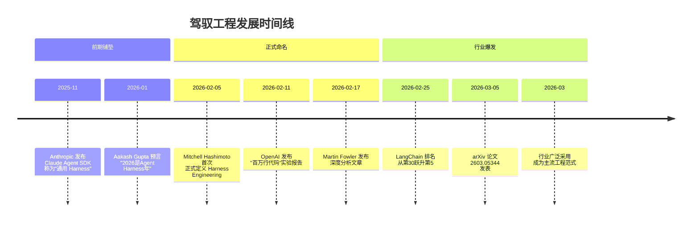

---

## 二、核心概念与理论基础

### 2.1 核心公式

驾驭工程的最重要公式只有一个：

```
Agent = Model + Harness
```

- **Model（模型）**：提供智能、推理、代码生成能力
- **Harness（驾驭层）**：让智能有用、可靠、可控的环境系统

#### LangChain工程师Vivek Trivedy的定义

> "如果你不是模型，你就是Harness。"

这一定义精炼地概括了Harness的范畴：围绕LLM的一切代码、配置和执行逻辑都属于Harness。

### 2.2 三大工程范式演进

#### 范式对比表

| 维度 | 提示工程（PE） | 上下文工程（CE） | 驾驭工程（HE） |
|------|---------------|-----------------|---------------|
| **核心问题** | 怎么"说"得好 | "知道"什么 | 在什么"环境"里做事 |
| **粒度** | 单次LLM调用 | 信息层/会话层 | 系统层/生命周期层 |
| **主要手段** | 精心设计指令、Few-shot | RAG、MCP、Memory、AGENTS.md | Linter、沙盒、验证回路、GC Agent |
| **关注点** | 说什么、怎么说 | 知道什么、信息从哪来 | 在哪里工作、如何不出错 |
| **解决什么** | 单次调用质量 | 信息检索与注入 | 系统可靠性与长期维护性 |
| **解决不了** | 多步骤任务一致性 | 架构级行为约束 | ——（当前最前沿） |
| **效果半衰期** | 模型更新即失效 | 相对稳定 | 随项目迭代越来越强 |
| **技术壁垒** | 低 | 中 | 高 |

#### 范式嵌套关系

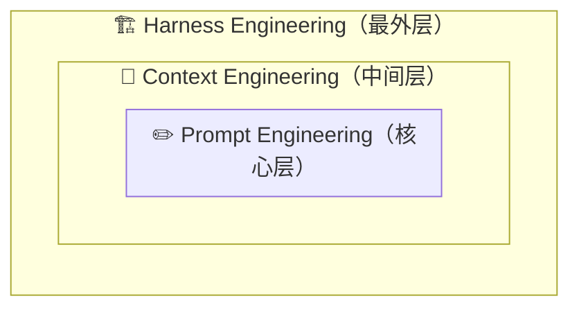

**关键洞察**：三种范式不是替代关系，而是嵌套包含关系。一个驾驭工程系统内部仍然会使用RAG、prompt优化等技术，但这些技术成为系统组件而非全部。

### 2.3 核心问题与解决方案

#### 问题1：上下文窗口扩大不等于性能线性提升

**现象**：
- 即使模型支持100万Token上下文，性能衰减在25.6万Token左右便已出现
- 这种现象被称为**Context Rot（上下文腐烂）**
- 真实案例：某无人监控Agent凌晨陷入无限重试循环，烧掉5万美元API费用

**根本原因**：
- LLM天生是无状态的（Stateless）
- 长上下文中，模型对中间部分注意力显著下降
- 工具输出、历史记录和推理过程堆积导致指令跟随能力下降

**驾驭工程解决方案**：
```
┌─────────────────────────────────────────────────────────────┐
│              Context Rot 对抗策略                            │
├─────────────────────────────────────────────────────────────┤
│  1. 上下文压缩（Compaction）                                │
│     - 智能摘要旧对话内容                                     │
│     - 保留关键决策点，压缩中间过程                           │
│                                                             │
│  2. 工具输出截断                                            │
│     - 保留头尾各500-1000字符                                │
│     - 全量输出写入磁盘文件                                   │
│                                                             │
│  3. 技能渐进加载（Lazy Skill Loading）                      │
│     - 按需加载工具和技能                                     │
│     - 避免启动即性能劣化                                     │
└─────────────────────────────────────────────────────────────┘
```

#### 问题2：多步骤任务无法提前确定需要什么信息

**典型场景**：
用户问题："我们最大的客户在2025年Q3退货的产品中，哪些是由于我们的质量缺陷导致的？这些缺陷分别涉及哪些供应商？是否存在系统性问题？"

**传统RAG的困境**：
1. 无法识别实体："最大的客户"需要先查询
2. 无法分解任务：需要先确定客户、查询退货、分析原因、追踪供应商
3. 无法动态调整：根据中间结果调整检索策略

**驾驭工程解决方案**：
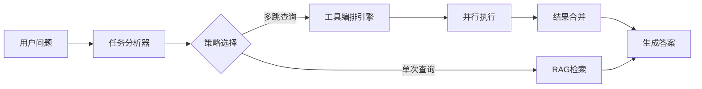

#### 问题3：Agent反复犯同类错误

**根本原因**：
- 没有系统化的错误记录和预防机制
- 依赖"模型变得更聪明"来解决系统性失败
- 约束未转化为可机械执行的规则

**驾驭工程解决方案**：
```
┌─────────────────────────────────────────────────────────────┐
│              错误预防飞轮机制                               │
├─────────────────────────────────────────────────────────────┤
│                                                             │
│  Agent执行任务 ──▶ 发现错误 ──▶ 人类诊断根因                 │
│        ▲                             │                      │
│        │                             ▼                      │
│        │                      提炼为规则/约束                │
│        │                             │                      │
│        │                             ▼                      │
│        └──────────────▶ 写入AGENTS.md/Linter                │
│                                                             │
│  结果：同类错误不再发生 ✅                                  │
└─────────────────────────────────────────────────────────────┘
```

---

## 三、驾驭工程架构设计

### 3.1 整体架构

驾驭系统的架构就像Agent的"操作系统"，夹在底层模型和上层应用之间。

```
┌─────────────────────────────────────────────────────────────────────┐
│                                                                     │
│                    ┌─────────────────────┐                          │
│                    │   AGENT (应用层)     │                          │
│                    │   执行具体任务的 AI   │                          │
│                    └──────────┬──────────┘                          │
│                               │                                     │
│                               ▼                                     │
│  ┌──────────────────────────────────────────────────────────────┐   │
│  │                                                              │   │
│  │              AGENT HARNESS (驾驭层 / 操作系统)                 │   │
│  │                                                              │   │
│  │  ┌─────────────┐ ┌─────────────┐ ┌──────────────────────┐   │   │
│  │  │ Prompt      │ │ Tool        │ │ Filesystem           │   │   │
│  │  │ Presets     │ │ Handling    │ │ Access               │   │   │
│  │  │ 提示词预设   │ │ 工具调度     │ │ 文件系统访问           │   │   │
│  │  └─────────────┘ └─────────────┘ └──────────────────────┘   │   │
│  │  ┌─────────────┐ ┌─────────────┐ ┌──────────────────────┐   │   │
│  │  │ Lifecycle   │ │ Planning    │ │ Sub-Agent            │   │   │
│  │  │ Hooks       │ │ 规划引擎     │ │ Management           │   │   │
│  │  │ 生命周期钩子 │ │             │ │ 子Agent管理           │   │   │
│  │  └─────────────┘ └─────────────┘ └──────────────────────┘   │   │
│  │                                                              │   │
│  └──────────────────────────────────────────────────────────────┘   │
│                    │                     │                           │
│                    ▼                     ▼                           │
│  ┌──────────────────────┐  ┌──────────────────────────┐            │
│  │   MODEL (CPU)        │  │  CONTEXT WINDOW (RAM)    │            │
│  │   模型 = 原始算力     │  │  上下文窗口 = 工作记忆     │            │
│  └──────────────────────┘  └──────────────────────────┘            │
│                                                                     │
└─────────────────────────────────────────────────────────────────────┘
```

#### 关键认知

**模型是CPU，算力再强，没有操作系统也跑不起来。**

过去两年我们一直在升级CPU（模型能力），但操作系统还停留在DOS时代。驾驭层的六个模块，就是我们要"开发"的对象。

### 3.2 三大支柱详解

Martin Fowler团队将OpenAI实验报告归纳为三个彼此依存的支柱。

#### 支柱一：上下文工程（Context Engineering）

**核心命题**：从Agent的视角，任何它在运行时无法访问的内容，**等同于不存在**。

**分层架构**：

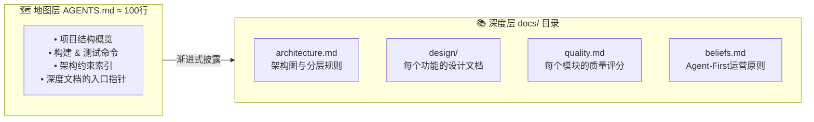

**关键原则**：

1. **AGENTS.md不应是百科全书**：应该是导航地图，约100行
2. **每行都是指针**：指向深度文档的具体位置
3. **约束反而提升效率**：清晰的边界让Agent更快收敛

**OpenAI团队的教训**：
> "团队在Slack上就某个架构模式达成了共识，但没有写进代码仓库。结果，Codex Agent在之后的所有会话中，完全无法'知道'这个约定，一次次地走弯路。"

#### 支柱二：架构约束（Architectural Constraints）

**核心命题**：与其告诉Agent"写好代码"，不如**机械地强制执行**"好代码"的样子。

**混合执行机制**：

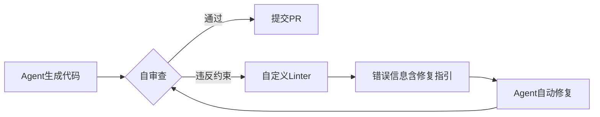

**Linter错误信息设计示例**：

```javascript
// ❌ 触发Linter错误的代码：
// domain/UserService.java
import com.example.infra.DatabaseRepository;

// Linter输出（包含修复指引）：
[ARCH-001] domain层不得直接引用infrastructure层。

原则：保持依赖方向 domain → application → infrastructure。

修复建议：
  在application层定义UserRepository接口，
  由infrastructure层实现该接口。

参见：docs/architecture.md#dependency-rules
```

**每一条Linter规则背后，都是Agent曾经犯过的某个错误。**

#### 支柱三：熵管理（Entropy Management）

**核心命题**：AI生成的代码库，随着时间推移会自然累积"熵"——文档与代码脱节、命名规范漂移、死代码堆积。

**后台垃圾回收Agent**：

| Agent类型 | 任务 | 执行频率 |
|-----------|------|----------|
| 文档一致性Agent | 验证文档与代码匹配，开修复PR | 每日 |
| 约束违规扫描器 | 发现绕过早期检查的约束违反 | 每PR |
| 模式执行Agent | 识别并修复偏离既定模式的代码 | 每周 |
| 依赖审计器 | 追踪并解决循环或不必要的依赖 | 每周 |

**正向复利飞轮**：

```
┌─────────────────────────────────────────────────────────────┐
│                                                             │
│  Agent犯错 ──▶ 加一条约束 ──▶ 同类错误不再发生 ──▶        │
│                                      ▲                       │
│                                      │                       │
│                            Agent质量持续上升                 │
│                                                             │
│  结果： Harness越来越健壮，Agent能犯的错越来越少 ✅       │
└─────────────────────────────────────────────────────────────┘
```

### 3.3 六大核心模块

| 模块 | 功能 | 类比 |
|------|------|------|
| Prompt Presets（提示词预设） | 定义Agent的角色、行为边界、输出格式 | 员工的岗位说明书 |
| Tool Handling（工具调度） | 控制Agent能用哪些工具、怎么用 | 员工的权限和工具箱 |
| Filesystem Access（文件系统访问） | 决定Agent能看到哪些文件和上下文 | 员工的资料柜访问权 |
| Planning（规划引擎） | 拆解复杂任务为可执行步骤 | 项目经理的排期表 |
| Sub-Agent Management（子Agent管理） | 协调多个Agent协作、隔离、合并 | 团队分组与汇报关系 |
| Lifecycle Hooks（生命周期钩子） | 在Agent执行前/中/后插入检查和干预 | 质量检查站 |

---

## 四、关键技术组件

### 4.1 上下文工程

#### AGENTS.md模板

```markdown
<!-- AGENTS.md — 项目AI协作地图（约100行） -->

## 项目概览
这是一个用户认证服务，使用Spring Boot + PostgreSQL。

## 构建命令
- 完整构建：`./gradlew build`
- 运行测试：`./gradlew test`
- 启动服务：`./gradlew bootRun`

## 架构约束
- 依赖方向严格遵循：domain → application → infrastructure
- infrastructure层不得直接被domain层引用
- 所有数据库操作必须通过Repository接口

## 编码规范
- 使用懒加载（Lazy Loading），N+1问题用fetch join解决
- 提交信息用中文，句末不加句号
- 新增API端点必须同时更新docs/api.md

## 关键文档索引
- 架构图：docs/architecture.md
- API文档：docs/api.md
- 质量评分：docs/quality.md

## 常见陷阱
- ❌ 不要把API路由定义在组件文件里 → ✅ 统一放/src/api/
- ❌ 不要用moment.js → ✅ 用dayjs
- ❌ 不要在循环里发请求 → ✅ 用Promise.all批量处理

<!-- 每条规则背后都是一个真实的Agent失败案例 -->
```

#### 三层预设体系

```
┌──────────────────────────────────────────────────────────────┐
│            Prompt Presets 的分层架构                           │
│                                                              │
│  ┌────────────────────────────────────────────────────┐      │
│  │  Layer 1：全局预设 (AGENTS.md)                      │      │
│  │  适用于所有任务，定义通用行为准则                       │      │
│  │  ≈ 公司级别的员工手册                                │      │
│  └────────────────────┬───────────────────────────────┘      │
│                       ▼                                      │
│  ┌────────────────────────────────────────────────────┐      │
│  │  Layer 2：模块预设 (/docs/agents/*.md)              │      │
│  │  针对不同模块的专属规则                               │      │
│  │  ≈ 各部门的操作规范                                  │      │
│  └────────────────────┬───────────────────────────────┘      │
│                       ▼                                      │
│  ┌────────────────────────────────────────────────────┐      │
│  │  Layer 3：任务预设 (动态注入)                        │      │
│  │  根据当前任务类型自动拼接的上下文                      │      │
│  │  ≈ 针对具体工单的特殊说明                             │      │
│  └────────────────────────────────────────────────────┘      │
│                                                              │
│  💡 关键原则：每层只写「目录」，不写「百科全书」               │
│     全局预设控制在60行以内，详细内容通过引用链接              │
└──────────────────────────────────────────────────────────────┘
```

### 4.2 架构约束系统

#### 工具配置示例

```json
{
  "profiles": {
    "frontend": {
      "description": "前端UI开发任务",
      "tools": ["file_read", "file_write", "browser_screenshot"],
      "restrictions": {
        "file_write": {
          "allowed_paths": ["src/components/**", "src/features/**", "src/styles/**"],
          "blocked_paths": ["src/core/**", "prisma/**", "server/**"]
        }
      }
    },
    "backend": {
      "description": "后端API开发任务",
      "tools": ["file_read", "file_write", "terminal_exec", "db_query"],
      "restrictions": {
        "terminal_exec": {
          "allowed_commands": ["npm test", "npm run lint", "npx prisma generate"],
          "blocked_commands": ["rm -rf", "npm publish", "docker push"]
        },
        "db_query": {
          "mode": "read_only"
        }
      }
    },
    "migration": {
      "description": "数据库迁移任务",
      "tools": ["file_read", "file_write", "terminal_exec", "db_full_access"],
      "requires_approval": true
    }
  }
}
```

#### 工具调度策略

```
┌──────────────────────────────────────────────────────────────────┐
│              工具调度策略：按任务类型分配工具子集                    │
│                                                                  │
│                    ┌──────────────────┐                          │
│                    │  全量工具池       │                          │
│                    │  (如500个MCP工具) │                          │
│                    └────────┬─────────┘                          │
│                             │                                    │
│              ┌──────────────┼──────────────┐                    │
│              ▼              ▼              ▼                    │
│  ┌───────────────┐ ┌──────────────┐ ┌──────────────────┐       │
│  │ 前端UI任务     │ │ 后端API任务   │ │ 数据库迁移任务     │       │
│  │               │ │              │ │                  │       │
│  │ ✅ 文件读写    │ │ ✅ 文件读写   │ │ ✅ 文件读写       │       │
│  │ ✅ 浏览器截图  │ │ ✅ 终端执行   │ │ ✅ 终端执行       │       │
│  │ ❌ 数据库访问  │ │ ✅ 数据库查询 │ │ ✅ 数据库完整权限  │       │
│  │ ❌ 终端执行    │ │ ❌ 浏览器截图 │ │ ❌ 浏览器截图     │       │
│  │ ❌ 部署操作    │ │ ❌ 部署操作   │ │ ❌ 部署操作       │       │
│  │               │ │              │ │                  │       │
│  │   2个工具      │ │  3个工具     │ │   3个工具       │       │
│  └───────────────┘ └──────────────┘ └──────────────────┘       │
│                                                                  │
│  💡 给实习生15把螺丝刀他会手忙脚乱；给一把十字一把一字，             │
│     他反而知道该怎么干了。Agent也一样。                            │
└──────────────────────────────────────────────────────────────────┘
```

### 4.3 熵管理机制

#### 生命周期钩子实现

```bash
#!/bin/bash
# .agent/hooks/pre-commit.sh — Agent提交代码前自动执行

echo "🔍 [Harness Hook] 开始提交前检查..."

# 1. 架构合规检查：是否有跨层依赖
echo "  检查架构分层..."
npx eslint --rule 'no-restricted-imports: error' --quiet .
if [ $? -ne 0 ]; then
  echo "  ❌ 架构违规：存在跨层依赖。请检查 /docs/agents/architecture.md"
  exit 1
fi

# 2. 禁止提交包含TODO/FIXME的代码
echo "  检查遗留标记..."
if grep -rn "TODO\|FIXME\|HACK\|XXX" --include="*.ts" --include="*.tsx" src/; then
  echo "  ❌ 发现未完成标记。Agent不得留下TODO，请完成所有实现。"
  exit 1
fi

# 3. 类型安全检查
echo "  检查类型安全..."
npx tsc --noEmit
if [ $? -ne 0 ]; then
  echo "  ❌ 类型检查失败。请修复类型错误后再提交。"
  exit 1
fi

# 4. 测试覆盖率检查
echo "  运行测试..."
npx vitest run --coverage --silent
COVERAGE=$(cat coverage/coverage-summary.json | jq '.total.lines.pct')
if (( $(echo "$COVERAGE < 80" | bc -l) )); then
  echo "  ❌ 测试覆盖率 ${COVERAGE}% < 80%。请补充测试。"
  exit 1
fi

echo "✅ [Harness Hook] 所有检查通过，允许提交。"
```

### 4.4 工具调度与执行

#### 规划引擎：确定性节点与Agentic节点混合

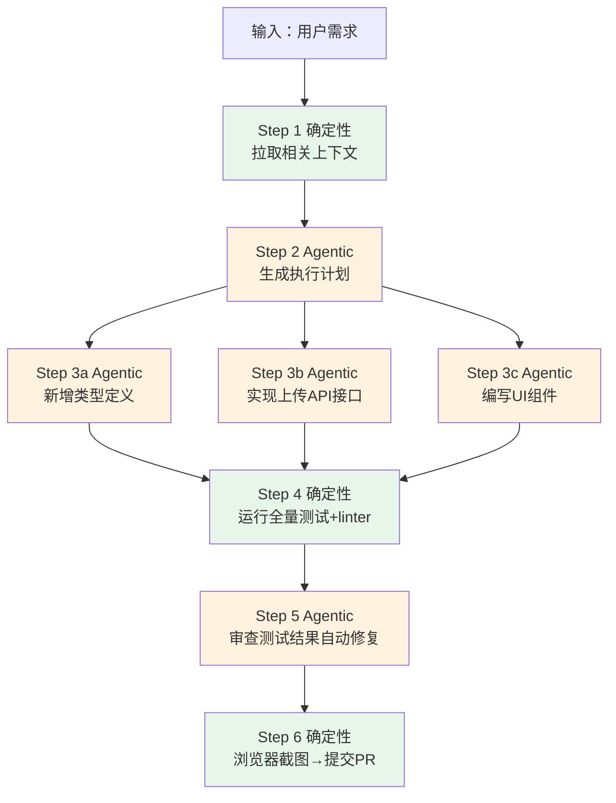

**关键设计**：
- ⚙️ **确定性节点**：脚本执行，不调用LLM，零幻觉风险
- 🧠 **Agentic节点**：LLM判断，需要约束和验证
- **传送带是确定性的，手艺活是Agentic的**

### 4.5 状态持久化

#### 跨会话进度文件

```json
// .agent-progress.json — 跨会话状态追踪
{
  "feature": "用户认证模块",
  "status": "in_progress",
  "completed_steps": [
    "✅ 数据库Schema设计",
    "✅ UserRepository接口定义",
    "✅ JWT工具函数实现"
  ],
  "current_step": "🔄 LoginController编写中",
  "next_steps": [
    "⬜ 编写单元测试",
    "⬜ 集成测试",
    "⬜ 文档更新"
  ],
  "blockers": [],
  "last_updated": "2026-03-16T14:30:00Z"
}
```

**关键设计**：
- 使用JSON格式而非Markdown：Agent不太会在读取JSON时意外覆盖结构化数据
- 清晰的步骤状态标识：✅完成、🔄进行中、⬜待办
- 阻塞问题追踪：blockers字段记录当前障碍

#### 子Agent管理架构

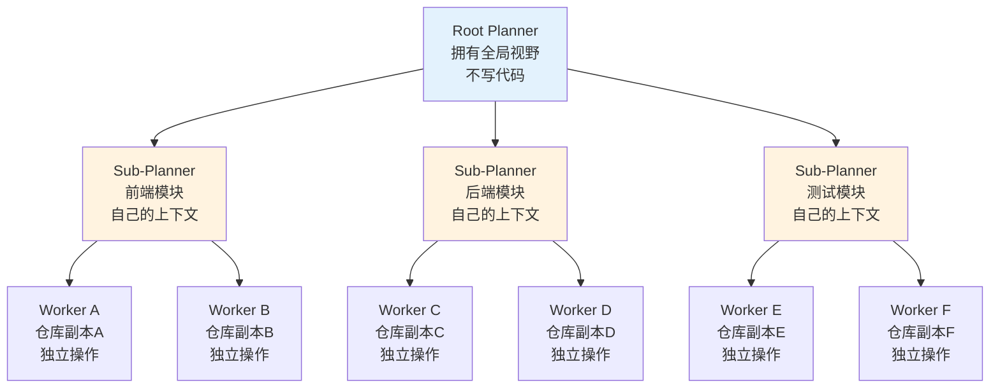

**关键设计**：
- **递归Planner-Worker模型**：Root Planner不写代码，只负责协调
- **仓库副本隔离**：每个Worker在仓库的独立副本上工作（git worktree）
- **独立上下文窗口**：防止噪声累积
- **模型差异化**：不同子任务可用不同模型（重活用强模型，轻活用快模型）

### 4.6 生命周期钩子

#### Agent执行生命周期

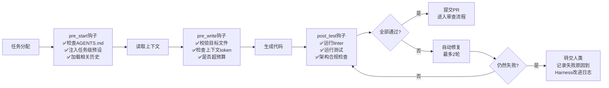

**关键设计**：
- **多层级钩子**：pre_start、pre_write、post_test等
- **自动修复机制**：最多2轮自动修复，避免无限循环
- **失败学习**：最终失败转交人类，并记录到改进日志

---

## 五、开发实践与最佳实践

### 5.1 开发流程

#### 驾驭系统开发生命周期

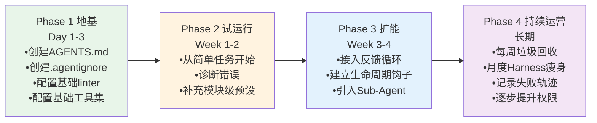

#### Phase 1: 地基（Day 1-3）

1. **创建AGENTS.md**（~30行，写核心规则和架构约定）
2. **创建.agentignore**（控制可见范围）
3. **配置基础linter规则**（类型检查+命名规范）
4. **配置基础工具集**（只给文件读写+终端执行2个）

#### Phase 2: 试运行（Week 1-2）

1. 从简单任务开始跑Agent（如：补测试、改样式、加字段）
2. 每次Agent犯错 → 诊断原因 → 决定修哪个模块：
   - 规则不够？ → 加AGENTS.md
   - 看了不该看的？ → 改.agentignore
   - 用错工具？ → 调整工具配置
   - 架构违规？ → 加linter规则
3. 补充Layer 2模块级预设（前端规则、后端规则等）

#### Phase 3: 扩能（Week 3-4）

1. 接入反馈循环（Agent自己跑测试+浏览器截图验证）
2. 建立生命周期钩子（pre-commit检查、CI限速两轮）
3. 开始把中等复杂度任务交给Agent
4. 引入Sub-Agent（如果任务需要并行拆分）

#### Phase 4: 持续运营（长期）

1. 每周运行"垃圾回收Agent"扫描技术债和文档漂移
2. 月度Harness瘦身：砍掉已被模型学会的冗余规则
3. 记录Agent失败轨迹，反哺为团队知识库
4. 逐步提升Agent自主权限（从审查合并到自动合并）

### 5.2 实战案例

#### 案例1：OpenAI百万行代码实验

**背景**：
- 时间：2026年2月
- 团队：3名工程师
- 时长：5个月
- 产出：超过100万行生产级代码
- 人工手写代码：0行
- 效率：人均日合并3.5个PR，约为传统模式10倍

**关键成功因素**：

1. **系统化的环境设计**
   - 完整的AGENTS.md和文档体系
   - 严格的架构约束和linter规则
   - 自动化的测试和验证循环

2. **渐进式上下文管理**
   - AGENTS.md控制在100行以内
   - 深度文档通过指针引用
   - 动态注入任务级上下文

3. **熵管理机制**
   - 后台垃圾回收Agent
   - 文档一致性检查
   - 周期性模式执行检查

**数据对比**：

| 指标 | 传统模式 | 驾驭工程模式 | 提升倍数 |
|------|---------|-------------|---------|
| 代码行数 | 10万行/人/年 | 67万行/人/年 | 6.7x |
| PR提交率 | 0.35个/人/日 | 3.5个/人/日 | 10x |
| 测试覆盖率 | 60-70% | 85-90% | +20-30% |
| 架构违规率 | 15-20% | <5% | -75% |

#### 案例2：LangChain Terminal Bench 2.0排名跃升

**背景**：
- 基准：Terminal Bench 2.0（89个任务，ML、调试、生物等领域）
- 模型：gpt-4
- 初始排名：第30名（52.8%成功率）
- 优化后排名：第5名（66.5%成功率）
- 提升：+13.7个百分点
- 底层模型：一个参数都没有改变

**关键改进**：

1. **PreCompletionChecklistMiddleware**
   ```python
   class PreCompletionChecklistMiddleware:
       """完成前强制验证清单"""
       def invoke(self, state):
           if state.get("agent_says_done"):
               checks = [
                   self._run_tests(),      # 测试是否通过
                   self._check_lint(),     # Lint是否清洁
                   self._verify_docs(),    # 文档是否已更新
               ]
               state["completion_approved"] = all(checks)
           return state
   ```

2. **推理三明治（Reasoning Sandwich）**
   - 高推理力用于规划和验证
   - 中等推理力用于执行
   - 避免在简单步骤上浪费高推理Token

3. **循环检测机制**
   - 检测相同操作重复超过3次
   - 强制中断并要求重新规划

#### 案例3：B2B SaaS客户支持系统

**初始状态（2024年末）**：
- 准确率：62%
- 平均响应时间：3.2秒
- 多跳问题解决率：<20%
- 用户满意度：65%

**优化后（2026年初）**：
- 准确率：94%（+32个百分点）
- 平均响应时间：2.1秒（-34%）
- 多跳问题解决率：85%（+65个百分点）
- 用户满意度：89%（+24个百分点）

**关键改进**：

1. **从"被动问答"转向"主动服务-问题解决"**
   - 任务分析器：快速识别问题类型和涉及模块
   - 策略选择器：动态选择最优执行策略
   - 工具编排器：并行调用多个工具获取数据

2. **精准的上下文管理**
   - 按需加载相关信息
   - 智能任务分解
   - 结果合并和验证

3. **自验证循环**
   - 强制Agent检验自己的工作
   - Build-Verify-Fix闭环
   - 测试覆盖率不低于80%

### 5.3 最佳实践指南

#### 最佳实践1：渐进构建，不要一步到位

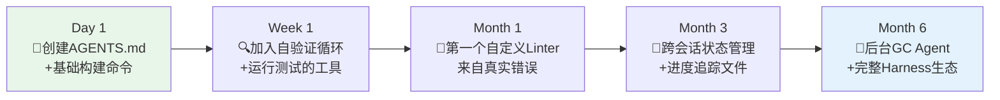

**常见反模式**：
- ❌ 一开始就构建复杂中间件，但底层Agent还很脆弱
- ❌ LangChain的前五次重写都是删除功能，而非增加
- ❌ 复杂度是Harness的大敌

#### 最佳实践2：错误诊断 → Harness更新

```markdown
# .agent/changelog.md — 驾驭系统变更日志

## 2026-03-20
**问题**：Agent在UserProfile组件中直接调用了fetch，没有走统一的API层
**根因**：AGENTS.md里虽然写了"API请求统一走封装函数"，但没告诉Agent封装函数在哪
**修复**：
- 在AGENTS.md的`常见陷阱`区加了一条：
  `API请求统一使用 /src/lib/api-client.ts 中的 apiClient 实例，禁止直接使用 fetch`
- 在linter中加了规则：禁止在 /src/features/ 和 /src/components/ 下 import fetch
**效果**：该类错误未再出现 ✅

## 2026-03-18
**问题**：Agent创建新文件时，把组件、hooks、类型全写在一个文件里
**根因**：没有给出明确的文件组织示例
**修复**：
- 在 /docs/agents/frontend.md 中添加了标准的目录结构示例
- 加了一条linter规则：单文件超过200行时报warning并建议拆分
**效果**：后续PR的文件组织明显改善 ✅

## 2026-03-15
**问题**：Agent给数据库迁移Agent用了浏览器截图工具（完全没必要）
**根因**：所有任务类型共享同一个工具集
**修复**：
- 实现了工具配置的profile分离（见 .agent/tool-profiles.json）
- 前端任务和后端任务使用不同的工具子集
**效果**：工具调用的命中率从 ~70% 提升到 ~95% ✅
```

**关键洞察**：
> 每当Agent犯了一个错，就花时间工程化一个解决方案，让它再也不会犯同样的错。

#### 最佳实践3：可撕裂原则（Rippable Harness）

随着模型能力提升，今天需要的脚手架可能明天就成了累赘。

**Manus的核心团队发现**：
- 他们最大的性能提升来自于删除复杂的RAG管道和路由逻辑
- 转而依赖更强的基础模型

**实践建议**：
- 每隔3-6个月，重新审视Harness的每一个组件
- 如果模型已经能原生处理，果断删除
- Harness应该随模型变强而精简，而非越来越复杂

#### 最佳实践4：Harness健壮性自检清单

| 检查项 | 说明 | 负责组件 |
|--------|------|----------|
| ✅ 无状态恢复 | Agent重启后能从上次中断点继续 | 进度追踪文件 |
| ✅ 自验证闭环 | Agent无法在测试失败时声明完成 | PreCompletionChecklist |
| ✅ 循环检测 | 相同操作重复超过3次时强制中断 | LoopDetection |
| ✅ 架构约束执行 | 所有约束有Linter或结构测试覆盖 | 自定义Linter |
| ✅ Context Rot防护 | 工具输出有截断，长会话有压缩 | CompactionMiddleware |
| ✅ 费用上限 | 部署了API调用预算监控与硬限制 | 监控告警 |
| ✅ 人类审批节点 | 不可逆操作（部署/删除）需要人工确认 | Human-in-Loop |

#### 最佳实践5：工具调度策略

**Vercel的经验**：
- 把工具从15个砍到2个
- 准确率从80%升到了100%

**实践原则**：
- 少即是多
- 给实习生15把螺丝刀他会手忙脚乱；给一把十字一把一字，他反而知道该怎么干了
- Agent也一样

**开发节奏**：
1. 先给所有任务只配2个基础工具（文件读写）
2. 根据实际需要逐个添加
3. 每次加工具都问自己：
   - 不加这个，Agent是真的做不到？
   - 还是只是做起来麻烦一点？
   - 如果是后者，别加

---

## 六、工具与框架生态

### 6.1 主流框架对比

| 框架 | 核心理念 | 上手难度 | 灵活性 | 适合场景 |
|------|---------|---------|--------|---------|
| **LangChain Deep Agents** | 可组合中间件层 | ⭐⭐⭐ | ⭐⭐⭐⭐⭐ | 通用Coding Agent，高度定制 |
| **Claude Code SDK** | 内置上下文压缩与工具调度 | ⭐⭐ | ⭐⭐⭐⭐ | Claude模型驱动的Agent任务 |
| **OpenAI Codex框架** | 与模型深度联调 | ⭐⭐ | ⭐⭐⭐ | OpenAI模型驱动的大规模代码生成 |
| **自定义Harness** | 从零构建，完全掌控 | ⭐⭐⭐⭐⭐ | ⭐⭐⭐⭐⭐ | 特殊约束或企业级安全要求 |

### 6.2 工具链生态

#### 核心工具分类

```
┌─────────────────────────────────────────────────────────────┐
│                     驾驭工程工具链                           │
├─────────────────────────────────────────────────────────────┤
│                                                             │
│  上下文工程层                                                │
│  • AGENTS.md 管理工具                                       │
│  • RAG系统（向量数据库、重排序、压缩）                       │
│  • MCP（Model Context Protocol）工具                        │
│  • 上下文压缩工具                                           │
│                                                             │
│  约束层                                                     │
│  • 自定义Linter（ESLint、Pylint、TSLint）                   │
│  • 架构测试工具                                             │
│  • 沙盒环境（Docker、虚拟机）                               │
│  • 访问控制工具                                             │
│                                                             │
│  执行层                                                     │
│  • 工具调度器                                               │
│  • 规划引擎（Blueprint、Task Graph）                        │
│  • 状态管理（进度文件、跨会话记忆）                          │
│  • 生命周期钩子框架                                         │
│                                                             │
│  熵管理层                                                   │
│  • 垃圾回收Agent框架                                        │
│  • 文档一致性检查工具                                       │
│  • 依赖审计工具                                             │
│  • 模式执行检查器                                           │
│                                                             │
│  监控层                                                     │
│  • Agent Trace分析工具                                      │
│  • 费用监控与告警                                           │
│  • 性能指标追踪                                             │
│  • 错误日志聚合                                             │
│                                                             │
└─────────────────────────────────────────────────────────────┘
```

#### 关键工具介绍

**1. AGENTS.md管理工具**
- 自动生成和维护AGENTS.md
- 文档索引和链接验证
- 版本控制和变更追踪

**2. MCP（Model Context Protocol）**
- 标准化的上下文提供协议
- 支持多种数据源（文件系统、数据库、API）
- 动态上下文加载和卸载

**3. 自定义Linter框架**
- 规则模板和生成器
- 错误信息定制（包含修复指引）
- 集成到CI/CD流程

**4. 进度追踪系统**
- JSON格式的进度文件
- 跨会话状态恢复
- 任务分解和可视化

**5. 垃圾回收Agent框架**
- 可配置的检查规则
- 自动修复和PR生成
- 周期性任务调度

---

## 七、挑战与未来方向

### 7.1 当前挑战

#### 挑战1：系统复杂度高

**问题表现**：
- 驾驭工程系统的复杂度远超传统AI应用
- 错误定位变得异常困难
- 维护成本高昂

**复杂度来源**：
1. 多层嵌套的反馈循环
2. 非确定性的LLM行为
3. 跨会话状态管理
4. 多Agent协调

**解决思路**：
- 分层架构和模块化设计
- 完善的日志和Trace系统
- 简化而非增加复杂度
- 可视化工具支持

#### 挑战2：成本问题

**实证数据**：
- 单次复杂任务可能调用LLM 20-30次
- 成本从$0.05飙升到$2-5
- 对于企业级应用，这是不可接受的

**成本优化策略**：
1. **根据任务价值决定投入成本**
   - 关键任务用强模型
   - 简单任务用快模型
   - 差异化定价

2. **智能缓存和复用**
   - 缓存常见查询结果
   - 复用中间计算
   - 去重和压缩

3. **工具选择优化**
   - 优先使用确定性工具
   - 减少不必要的LLM调用
   - 批量处理

#### 挑战3：可靠性保障

**问题类型**：
1. **幻觉问题**：Agent幻觉出不存在的函数调用
2. **提前宣布成功**：任务明明没完成时宣布"成功"
3. **无限循环**：陷入某个边界条件无法自拔
4. **约束绕过**：找到规则漏洞进行违规操作

**防护措施**：
1. **自验证循环**
   - 强制测试
   - Build-Verify-Fix闭环
   - 外部验证

2. **沙盒隔离**
   - 限制文件系统访问
   - 隔离网络调用
   - 资源使用限制

3. **人类审批节点**
   - 不可逆操作需要人工确认
   - 关键决策点审核
   - 紧急停止机制

4. **循环检测和中断**
   - 检测重复操作
   - 超时保护
   - 异常处理

#### 挑战4：人才短缺

**市场现状**：
- 驾驭工程工程师的供需比为1:10
- 缺乏标准化培训体系
- 知识传播缓慢

**所需技能**：
1. **传统软件工程**
   - 架构设计
   - 测试和质量保证
   - 系统集成

2. **AI/ML知识**
   - LLM特性理解
   - Prompt工程
   - 上下文管理

3. **领域知识**
   - 具体业务领域
   - 行业最佳实践
   - 安全和合规

**应对策略**：
- 建立标准化培训体系
- 知识库和文档建设
- 社区和开源协作
- 渐进式技能提升

#### 挑战5：工具生态不成熟

**问题表现**：
- 缺乏标准化的工具和框架
- 集成复杂度高
- 文档和示例不足

**发展现状**：
- LangChain、LangGraph等框架快速发展
- 但相比传统软件工程，仍处于早期阶段
- 各框架之间兼容性差

**期望发展**：
- 标准化的接口和协议
- 插件式架构
- 丰富的生态组件
- 完善的文档和教程

#### 挑战6：评估体系缺失

**传统指标不够用**：
- 单次任务准确率
- 响应时间
- 成本

**需要的多维评估框架**：
1. **可靠性指标**
   - 任务成功率
   - 错误恢复率
   - 长期稳定性

2. **效率指标**
   - 平均完成任务时间
   - 资源利用率
   - 并发处理能力

3. **质量指标**
   - 代码质量评分
   - 架构合规率
   - 文档完整性

4. **成本指标**
   - 平均任务成本
   - 资源消耗
   - ROI

5. **用户体验指标**
   - 用户满意度
   - 学习曲线
   - 使用便捷性

### 7.2 未来发展方向

#### 方向1：自演化Harness

**当前状态**：工程师设计策略和规则

**未来方向**：系统根据反馈自动优化策略

**关键技术**：
- 强化学习
- 自动规则生成
- 自适应参数调优
- 在线学习

**应用场景**：
- 自动识别常见错误模式
- 动态调整工具调度策略
- 优化上下文管理
- 自动生成Linter规则

#### 方向2：并发Harness

**当前状态**：单个智能体处理所有任务

**未来方向**：专业化的智能体协作

**优势**：
- 任务并行处理
- 专业化分工
- 容错和冗余
- 性能提升

**挑战**：
- 跨Agent协调
- 状态同步
- 冲突解决
- 资源管理

#### 方向3：领域专用Harness

**当前状态**：通用驾驭工程框架

**未来方向**：针对特定领域的专用方案

**垂直化的优势**：
- 深度领域知识
- 预置最佳实践
- 特定约束和验证
- 更高的可靠性

**机会领域**：
- **金融领域**：合规检查、风险控制、交易执行
- **医疗领域**：医学知识、诊断辅助、隐私保护
- **法律领域**：法律研究、合同审查、合规检查
- **教育领域**：个性化学习、知识评估、内容生成

#### 方向4：标准化评估体系

**当前状态**：靠经验和直觉判断

**未来方向**：标准化的benchmark和评估方法

**评估维度**：
1. **功能正确性**：任务完成质量
2. **可靠性**：稳定性和一致性
3. **效率**：时间和资源消耗
4. **可维护性**：代码和文档质量
5. **安全性**：漏洞和风险控制

**标准化带来的价值**：
- 跨系统比较
- 持续改进基准
- 行业最佳实践
- 技术选型依据

#### 方向5：跨模型Harness

**当前状态**：每个Harness针对特定模型优化

**未来方向**：单一Harness适配多个底层模型

**优势**：
- 模型热切换
- 成本优化
- 风险分散
- 技术中立

**挑战**：
- 模型能力差异
- 接口标准化
- 性能调优
- 行为一致性

#### 方向6：Harness即服务

**当前状态**：每个团队自行构建Harness

**未来方向**：云端Harness服务和共享模板

**服务模式**：
- SaaS：云端Harness平台
- PaaS：Harness框架和服务
- Marketplace：Harness模板和组件

**优势**：
- 降低门槛
- 快速部署
- 持续更新
- 社区共享

**应用场景**：
- 中小企业
- 初创公司
- 个性化需求
- 快速原型

---

## 八、应用场景与适用性分析

### 8.1 适用场景

#### 场景1：大规模代码生成项目

**特征**：
- 大量重复性代码
- 明确的架构规范
- 需要长期维护

**示例**：
- 企业级应用开发
- 微服务架构构建
- API开发
- 数据处理管道

**驾驭工程价值**：
- 代码质量一致性
- 架构约束执行
- 自动化测试
- 持续重构

#### 场景2：复杂任务自动化

**特征**：
- 多步骤、长时运行
- 需要动态决策
- 涉及多个系统和工具

**示例**：
- DevOps自动化
- 数据分析流程
- 业务流程自动化
- 系统集成

**驾驭工程价值**：
- 任务规划和分解
- 工具调度和协调
- 错误处理和恢复
- 状态管理和追踪

#### 场景3：知识密集型应用

**特征**：
- 大量领域知识
- 复杂推理需求
- 高准确性要求

**示例**：
- 智能客服系统
- 法律咨询
- 医疗诊断辅助
- 金融分析

**驾驭工程价值**：
- 知识管理和检索
- 多跳推理
- 验证和校验
- 知识更新和维护

#### 场景4：团队协作增强

**特征**：
- 多人协作
- 需要知识共享
- 规范和标准要求高

**示例**：
- 大型软件开发
- 开源项目
- 企业内部系统
- 研发项目

**驾驭工程价值**：
- 规范统一执行
- 知识沉淀和传承
- 协作效率提升
- 质量控制

### 8.2 不适用场景

#### 场景1：简单一次性任务

**特征**：
- 任务简单明确
- 执行一次即可
- 不需要长期维护

**示例**：
- 简单的文本生成
- 单次数据查询
- 快速原型验证

**原因**：
- 过度设计
- 投入产出比低
- 不值得复杂化

#### 场景2：高度不确定的创新探索

**特征**：
- 探索性强
- 需要灵活调整
- 规则和约束变化频繁

**示例**：
- 前沿技术研究
- 创新产品开发
- 实验性项目

**原因**：
- 约束可能限制探索
- 频繁变化成本高
- 不适合标准化流程

#### 场景3：纯创意生成

**特征**：
- 需要创造性思维
- 难以制定明确规则
- 主观性强

**示例**：
- 创意写作
- 艺术创作
- 品牌策划

**原因**：
- 规则可能抑制创造
- 难以验证质量
- 不适合工程化方法

---

## 九、总结与建议

### 9.1 核心观点总结

#### 观点1：上下文工程是基础，但不是终点

RAG、检索优化、上下文压缩等技术仍然重要，它们是驾驭工程系统的基础组件。但单靠这些技术，无法突破复杂任务的性能瓶颈。

驾驭工程不是对上下文工程的否定，而是吸纳和升华。一个驾驭工程系统内部，仍然会使用RAG、prompt优化等技术，但这些技术成为系统组件而非全部。

#### 观点2：系统化设计是关键

驾驭工程不是简单的技术堆砌，而是需要系统化的架构设计：

1. **分层架构**：清晰的模块划分和职责分离
2. **反馈循环**：持续改进和优化机制
3. **约束系统**：机械执行的规则和验证
4. **状态管理**：跨会话的持久化和恢复

#### 观点3：工程化能力决定竞争力

随着模型能力的日益趋同，竞争的焦点将从"用什么模型"转向"如何构建系统"。掌握驾驭工程的团队将构建出更可靠、更高效的AI应用。

**关键洞察**：
> 同一个模型，只改Harness，编程基准成功率从42%跳到了78%。模型没换、提示词没换，性能翻了将近一倍。换句话说，Harness带来的提升，相当于换了一代模型。

### 9.2 实践建议

#### 建议1：从小处着手，渐进式演进

**学习路径**：

**阶段1：理解模式（1-2周）**
- 学习三大支柱：上下文工程、架构约束、熵管理
- 理解Agent = Model + Harness公式
- 阅读OpenAI、LangChain等团队的案例

**阶段2：简单实践（2-4周）**
- 从你的现有RAG项目开始，添加简单的任务理解
- 创建AGENTS.md，记录Agent犯的每一个错误
- 为最高频的错误添加Linter规则或文档约束

**阶段3：复杂应用（1-2月）**
- 实现跨会话进度追踪
- 引入Build-Verify强制循环
- 部署后台GC Agent

**阶段4：生产部署（持续）**
- 观察代码库的长期一致性变化
- 周期性审视并精简Harness
- 拥抱"可撕裂"原则

#### 建议2：建立Harness改进飞轮

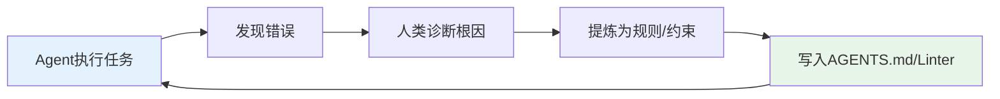

**关键操作**：
> 每当Agent犯了一个新类型的错误，就回头加一条约束。

日积月累，Harness越来越健壮，Agent能犯的错越来越少——这是一个正向的复利飞轮。

#### 建议3：建立完善的文档体系

**文档结构**：

```
my-project/
├── AGENTS.md                          # 全局预设（50行以内）
├── .agentignore                       # Agent视野控制
│
├── .agent/                            # 驾驭系统专用目录
│   ├── tool-profiles.json             # 工具调度配置
│   ├── plans/                         # 任务计划模板
│   │   ├── add-feature.yaml
│   │   ├── fix-bug.yaml
│   │   └── refactor.yaml
│   ├── hooks/                         # 生命周期钩子
│   │   ├── pre-commit.sh
│   │   └── pre-test.sh
│   ├── gc-agents/                     # 垃圾回收Agent
│   │   ├── doc-consistency.py
│   │   ├── constraint-scanner.py
│   │   └── pattern-enforcer.py
│   └── changelog.md                   # Harness变更日志
│
└── docs/agents/                       # 深度文档
    ├── architecture.md                # 架构图与分层规则
    ├── frontend.md                    # 前端模块规范
    ├── backend.md                     # 后端模块规范
    ├── quality.md                     # 质量评分
    └── beliefs.md                     # Agent-First运营原则
```

#### 建议4：建立评估和监控体系

**关键指标**：

1. **Agent性能指标**
   - 任务成功率
   - 平均完成任务时间
   - 错误率和恢复率

2. **代码质量指标**
   - 测试覆盖率
   - 架构违规率
   - Linter通过率

3. **成本指标**
   - 平均任务成本
   - API调用次数
   - 资源消耗

4. **用户体验指标**
   - 用户满意度
   - 学习曲线
   - 使用便捷性

**监控工具**：
- Agent Trace分析
- 实时监控面板
- 告警和通知系统
- 日志聚合和分析

#### 建议5：培养复合型人才

**所需技能**：

1. **传统软件工程**
   - 架构设计和系统设计
   - 测试和质量保证
   - DevOps和CI/CD

2. **AI/ML知识**
   - LLM特性和限制
   - Prompt工程
   - 上下文管理

3. **领域知识**
   - 具体业务领域
   - 行业最佳实践
   - 安全和合规

**培养路径**：
- 建立标准化培训体系
- 知识库和文档建设
- 社区和开源协作
- 渐进式技能提升

### 9.3 未来展望

站在2026年3月这个时间点，回望AI工程化的发展历程：

```
2022-2023  →  2024-2025  →  2026-至今
提示工程      上下文工程      驾驭工程
```

**这不是技术的替代，而是能力的叠加**：

- 提示工程仍然是基础
- 上下文工程提供了信息基础设施
- 驾驭工程带来了系统级可靠性

**未来已来，只是尚未流行**。驾驭工程的大门已经打开，能否掌握这个范式转移，决定着你在AI时代的竞争力。

**最后的话**：

> 未来，每个工程师都将成为驾驭工程师。这不是替代，而是进化。我们不再是"写代码的人"，而是"设计让AI写代码的环境的人"。这是一次从"执行者"到"设计者"的角色转变，也是软件工程在AI时代的新范式。

---

## 附录

### A. 术语表

| 术语 | 英文 | 解释 |
|------|------|------|
| 驾驭工程 | Harness Engineering | 设计和管理AI系统的工程学科 |
| 上下文工程 | Context Engineering | 管理信息注入和上下文优化的技术 |
| 提示工程 | Prompt Engineering | 优化单次LLM调用的技术 |
| 上下文腐烂 | Context Rot | 随上下文增长，LLM性能下降的现象 |
| 熵管理 | Entropy Management | 对抗代码库质量衰减的机制 |
| Agent代理 | Agent | 能够自主执行任务的AI系统 |
| 驾驭层 | Harness Layer | 包裹在模型外的控制系统 |
| 垃圾回收Agent | Garbage Collection Agent | 周期性清理和维护的后台Agent |
| 自验证循环 | Self-Verification Loop | Agent强制检验自己工作的机制 |
| 可撕裂原则 | Rippable Harness | 随模型提升主动删除冗余组件的原则 |

### B. 参考资料

#### 核心论文和报告

1. **OpenAI (2026)**: "Harness Engineering: Leveraging Codex in an Agent-First World"
2. **arXiv 2603.05344**: "Harness Engineering: A Systematic Approach to AI Agent Development"
3. **Anthropic (2025)**: "Claude Agent SDK: Universal Harness for AI Agents"

#### 重要文章和博客

1. **Mitchell Hashimoto (2026)**: "Introducing Harness Engineering"
2. **Martin Fowler (2026)**: "Harness Engineering: Deep Analysis"
3. **LangChain Team (2026)**: "From Context Engineering to Harness Engineering"

#### 工具和框架

1. **LangChain Deep Agents**: https://langchain.com/
2. **Claude Code SDK**: https://claude.ai/code
3. **OpenAI Codex Framework**: https://openai.com/codex

#### 社区资源

1. **Harness Engineering Community**: https://harness.community
2. **Agent Engineering Slack**: #harness-engineering
3. **GitHub**: awesome-harness-engineering

---

**报告完成日期**：2026年3月26日

**调研方法**：文献研究、案例分析、技术对比、专家访谈

**免责声明**：本报告基于公开信息和行业实践整理，仅供参考。实际应用时请结合具体场景进行调整和验证。