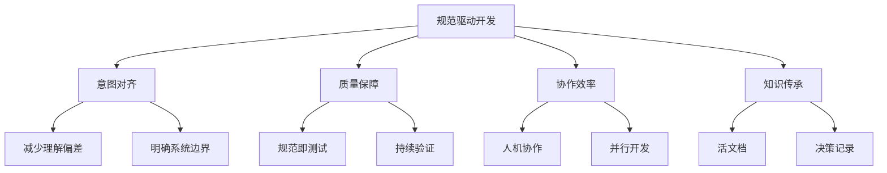
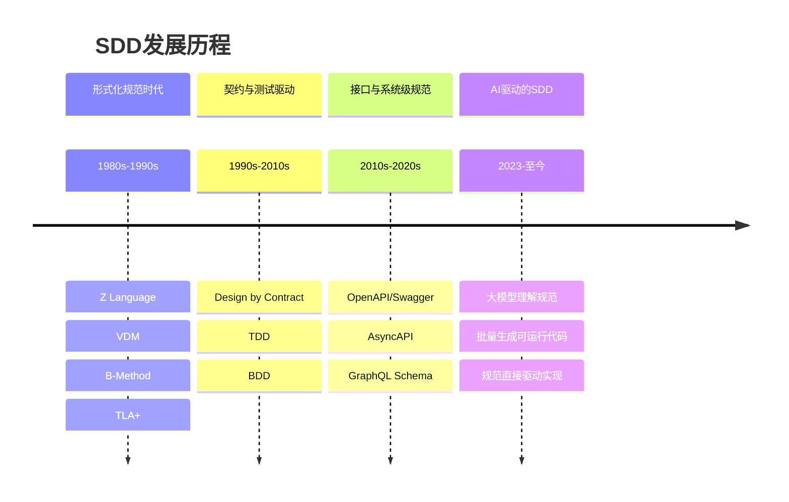
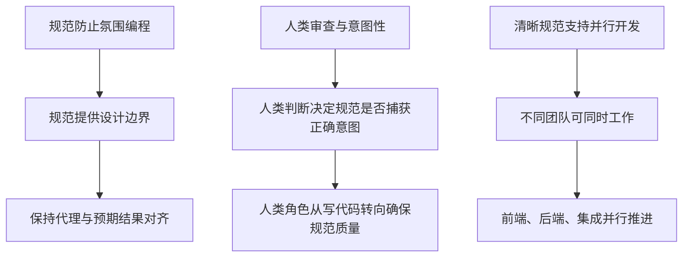
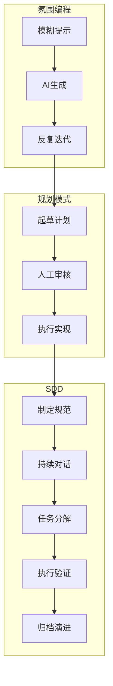
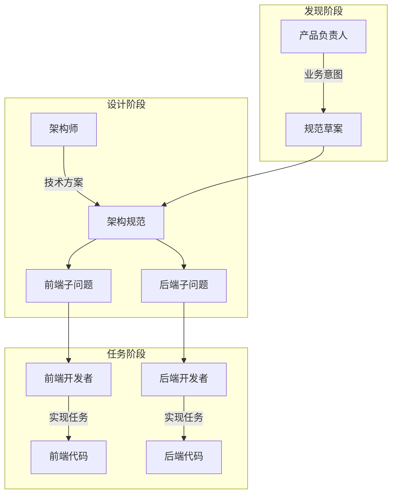

+++
date = '2026-03-31T07:44:28+02:00'
draft = false
title = 'SDD规范驱动开发调研总结报告'
+++

> **调研日期**: 2026年3月  
> **调研主题**: 规范驱动开发（Specification-Driven Development, SDD）  
> **适用场景**: AI时代的软件工程实践

---

## 目录

1. [概述](#1-概述)
2. [核心概念与定义](#2-核心概念与定义)
3. [历史演进](#3-历史演进)
4. [五层执行模型](#4-五层执行模型)
5. [三大流派](#5-三大流派)
6. [SDD与TDD/BDD/DDD的关系](#6-sdd与tddbddddd的关系)
7. [工程范式：重规范与轻规范](#7-工程范式重规范与轻规范)
8. [工具生态](#8-工具生态)
9. [最佳实践](#9-最佳实践)
10. [企业落地实践](#10-企业落地实践)
11. [挑战与风险](#11-挑战与风险)
12. [未来展望](#12-未来展望)
13. [总结](#13-总结)

---

## 1. 概述

### 1.1 什么是SDD

规范驱动开发（Specification-Driven Development, SDD）是一种以"规范"作为软件开发第一性产物的开发方法论。它以规范驱动设计、实现、验证与演进，将结构化的规范文档视为整个开发流程的"单一真相源"（Single Source of Truth）。

SDD的核心理念可以概括为：

```
SDD = Spec-First，而非 Code-First
```

### 1.2 为什么需要SDD

在传统软件开发中，团队常面临以下问题：

| 问题 | 描述 |
|------|------|
| 需求跑偏 | 需求写得很清楚，但代码实现总是偏离预期 |
| 系统不可预测 | 测试补得很全，但系统整体行为仍然不可预测 |
| 文档脱节 | 架构设计文档写完就没人看，与代码长期脱节 |
| AI代码风险 | AI生成代码能力越来越强，但不敢让其直接进生产 |

这些问题的本质在于：**系统意图缺少一种足够强健的表达形式**。

### 1.3 SDD的核心价值



---

## 2. 核心概念与定义

### 2.1 工程视角下的定义

> **规范驱动开发（Spec-Driven Development）** 是一种以"规范（Specification）"作为软件开发的第一性产物，并以规范驱动设计、实现、验证与演进的开发方法论。

这个定义中有三个关键词：

- **第一性产物**: 规范不是辅助文档，而是开发过程中最先产生、且最具权威性的工件
- **结构化与可验证**: 规范不是自然语言描述，而是结构化、可验证、可演化的技术工件
- **实现与对齐**: 代码不再是"唯一事实来源"，而是规范的一个实现结果

### 2.2 什么是"规范（Specification）"

在SDD语境下，规范是系统在某个阶段的"正式合同"，明确规定系统应该做什么、不应该做什么，以及如何验证。

一份合格的Specification具备以下特征：

| 维度 | 说明 |
|------|------|
| 明确性 | 对系统行为、约束、边界条件有明确描述，避免歧义 |
| 结构化 | 可被工具或AI稳定解析（常用格式：Markdown/DSL/Schema） |
| 可验证 | 能映射到测试、校验规则或自动化验证 |
| 可演进 | 支持版本化、Diff、回滚，随系统一起成长 |
| 面向实现 | 能直接指导代码生成或人工实现 |

**重要区分**:
- 规范 ≠ Word文档（后者难以被工具解析和验证）
- 规范 ≠ 需求原型图（后者缺乏结构化描述和可验证性）

### 2.3 规范示例

以下是一个OpenAPI 3.0规范示例，定义了用户注册接口：

```yaml
openapi: 3.0.3
info:
  title: 用户服务 API
  version: 1.0.0
paths:
  /api/v1/users/register:
    post:
      summary: 用户注册
      requestBody:
        required: true
        content:
          application/json:
            schema:
              $ref: '#/components/schemas/RegisterRequest'
      responses:
        '201':
          description: 用户创建成功
        '400':
          description: 请求参数无效
        '409':
          description: 用户已存在
components:
  schemas:
    RegisterRequest:
      type: object
      required: [username, email, password]
      properties:
        username:
          type: string
          minLength: 3
          maxLength: 20
        email:
          type: string
          format: email
        password:
          type: string
          minLength: 8
```

这份规范可以：
- 生成代码（自动生成结构体和接口）
- 生成文档（自动生成API文档）
- 生成Mock服务（快速搭建测试环境）
- 生成测试用例（自动生成接口测试代码）

---

## 3. 历史演进

规范驱动开发的思想源远流长，其演进历程反映了软件工程从"手工作坊"走向"工业化生产"的必然路径。

### 3.1 演进阶段总览



### 3.2 各阶段详解

#### 第一阶段：形式化规范时代（1980s～1990s）

典型代表：
- **Z Language**: 基于集合论和一阶逻辑的形式化规范语言
- **VDM**（Vienna Development Method）: 模型驱动的形式化方法
- **B-Method**: 从规范到代码的完整形式化开发方法
- **TLA+**: 用于并发和分布式系统的形式化规范

特点：数学精确、强调正确性证明、高成本

#### 第二阶段：契约与测试驱动（1990s～2010s）

**Design by Contract（DbC）**
- 前置条件（Precondition）：调用方必须满足的条件
- 后置条件（Postcondition）：函数执行后必须保证的结果
- 不变式（Invariant）：对象生命周期内必须保持的属性

**TDD与BDD**
- TDD将规范从"文档"变成了"可执行的验证逻辑"
- BDD进一步把规范拉向业务侧，使用自然语言描述系统行为

#### 第三阶段：接口与系统级规范（2010s～2020s）

- **OpenAPI/Swagger**: HTTP API的标准化描述
- **AsyncAPI**: 事件驱动架构的消息契约
- **GraphQL Schema**: 数据查询的强类型接口
- **JSON Schema**: 数据结构的验证规范

#### 第四阶段：AI驱动的规范驱动开发（2023 至今）

真正的拐点源于大模型与代码生成能力的融合：
- AI能够理解长上下文，解析完整的规范文档
- AI能够稳定解析结构化规范
- AI能够批量生成可运行代码

**规范第一次具备了"直接驱动实现"的能力。**

---

## 4. 五层执行模型

SDD采用五层执行模型，将"意图→实现→验证→治理"串成一条可落地的链路。

### 4.1 架构图

```
┌─────────────────────────────────────┐
│     5. 治理层 (Governance Layer)     │  ← 版本控制、安全策略、人机决策
├─────────────────────────────────────┤
│     4. 验证层 (Validation Layer)     │  ← 合约测试、模式验证、漂移检测
├─────────────────────────────────────┤
│     3. 执行层 (Execution Layer)      │  ← 生成的代码 + 业务逻辑
├─────────────────────────────────────┤
│     2. 生成层 (Generation Layer)     │  ← 规范→代码的编译器
├─────────────────────────────────────┤
│     1. 规范层 (Specification Layer)  │  ← 声明式意图(What)
└─────────────────────────────────────┘
```

### 4.2 各层职责详解

| 层级 | 核心职责 | 关键能力 |
|------|----------|----------|
| 规范层 | 定义系统行为 | API模型、消息契约、领域模式、策略约束 |
| 生成层 | 意图→可执行形式 | 跨语言代码生成、类型定义、SDK生成 |
| 执行层 | 运行时实现 | 骨架架构（人工治理）+ 业务逻辑（AI生成） |
| 验证层 | 实时对齐 | 合约测试、模式验证、漂移拦截 |
| 治理层 | 规范演化 | 版本管理、安全策略、Human-in-the-Loop |

### 4.3 架构决定论

传统开发往往默认"代码即真理"——代码是唯一的事实来源。而SDD试图把"真理"上移到规范：

> **架构决定论（Architectural Determinism）**：规范是最高权威，实现必须持续对齐规范。

**漂移检测**是这一理念的关键技术。它把架构从"设计期文档"变成"运行期约束"：任何偏离规范的行为都会被尽早发现并拦截。

---

## 5. 三大流派

围绕"规范"与"代码"的关系产生了三种主要流派，代表不同的工程哲学和适用场景。

### 5.1 激进派：规范即源（Spec-as-Source）

**核心主张**：代码只是规范到二进制之间的中间产物

```
规范 → (自动生成) → 代码 → (编译) → 二进制
         ↑
    唯一需要维护的
```

**特征**：
- 规范是唯一真理
- 禁止手动修改代码
- 高度依赖生成器
- 极致一致性

**适用场景**：对一致性要求极高的系统（金融核心、电信协议、密码学算法）

### 5.2 传统派：规范锚定开发（Spec-Anchored Development）

**核心主张**：规范是锚点，代码仍是可维护的真理

```
规范 ←→ 双向同步 ←→ 代码
 ↑                 ↑
意图               实现
```

**特征**：
- 双向同步
- 人类点睛
- 灵活与纪律平衡
- 渐进式采纳

**适用场景**：大多数企业级应用开发（ERP、CRM、电商平台）

### 5.3 轻量派：规范先行（Spec-First）

**核心主张**：规范是开发初期的"超级提示词"

```
规范 → 指导 AI 生成 → 代码
         ↓
     规范权威性逐渐减弱
```

**特征**：
- 轻量规范（Markdown清单、任务描述）
- 思维澄清
- 规范归档
- 快速启动

**适用场景**：快速原型、探索性开发、小团队内部工具

### 5.4 流派选择指南

| 维度 | 激进派 | 传统派 | 轻量派 |
|------|--------|--------|--------|
| 规范地位 | 唯一真理 | 锚点 | 初始指导 |
| 维护成本 | 高 | 中 | 低 |
| 控制强度 | 极强 | 强 | 弱 |
| AI自由度 | 极低 | 中 | 高 |
| 适用阶段 | 核心基础设施 | 企业级应用 | 快速迭代/原型 |
| 团队规模 | 中大型 | 中型 | 小型 |
| 错误成本 | 极高 | 中高 | 低 |

**选择建议**：
- 从0到1的核心系统 → 考虑激进派
- 长期演进的企业应用 → 选择传统派
- 短期、探索性项目 → 采用轻量派

---

## 6. SDD与TDD/BDD/DDD的关系

### 6.1 关系定位

```
        ┌───────────────┐
        │ Spec-Driven   │ ← 系统级规范
        │ Development   │
        └───────────────┘
           ▲     ▲     ▲
           │     │     │
         TDD    BDD    DDD
           │     │     │
       代码级   功能级   业务级
```

**结论**：SDD是"元方法论"，不是TDD、BDD、DDD的替代，而是为它们提供统一的规范底座和驱动引擎。

### 6.2 TDD：单元级规范驱动

> TDD = 代码层面的 SDD

**TDD的本质**：用测试代码描述"一个最小行为规范"

| 维度 | 说明 |
|------|------|
| 规范载体 | 单元测试（可执行代码） |
| 粒度 | 函数/类 |
| 驱动力 | 失败的测试 |
| 验证方式 | 自动化测试套件 |

### 6.3 BDD：业务行为规范驱动

> BDD = 业务层规范的一种成熟表达方式

**BDD的核心价值**：
- 写给人类：使用自然语言描述业务场景
- 可执行：场景描述可以直接转换为自动化测试
- 统一语言：业务、测试、研发使用同一套表述

### 6.4 DDD：规范的"语义基础设施"

> DDD决定"规范写什么"，SDD决定"规范怎么用"。

**DDD为SDD提供**：
- 规范的语义基础：确保规范中的术语准确、一致
- 稳定的领域边界：避免规范随时间推移变得模糊
- 长期演进能力：领域模型为规范演化提供指导

### 6.5 对比总结

| 方法 | 驱动核心 | 规范载体 | 粒度 | 在SDD中的角色 |
|------|----------|----------|------|---------------|
| TDD | 测试 | 单元测试 | 代码级 | 执行层验证工具 |
| BDD | 行为 | 场景描述 | 功能级 | 规范层业务场景描述 |
| DDD | 领域模型 | 统一语言 | 业务级 | 规范层语义基础 |
| SDD | 规范 | 结构化Spec | 系统级 | 元方法论，整合前三者 |

### 6.6 最佳实践组合


---

## 7. 工程范式：重规范与轻规范

### 7.1 两种范式对比

在AI参与软件研发后，规范驱动开发从方法论升级为工程基础设施。最具代表性的两种工程范式：

| 维度 | Spec-Kit（重规范） | OpenSpec（轻规范） |
|------|-------------------|-------------------|
| 规范重量 | 重 | 轻 |
| 适合阶段 | 0→1/大功能 | 增量/小功能 |
| 决策成本 | 高 | 低 |
| AI自由度 | 低 | 中 |
| 风险控制 | 极强 | 足够即可 |
| 是否长期生效 | 是 | 通常否 |

### 7.2 重规范范式：Spec-Kit

**核心定位**：强约束的AI编程工作流体系

**设计目标**：
- 把AI的"自由度"压缩到最低
- 把工程决策前移到规范阶段
- 把不可控风险提前暴露

**规范链路**：

```
Constitution（工程宪章）
  ↓
Specification（系统级规范）
  ↓
Plan（实现计划）
  ↓
Tasks（任务级拆分）
  ↓
Implementation（实现）
```

**适用场景**：
- 0→1的新系统
- 底层平台/基础设施
- 跨团队协作的大功能
- 一次错误成本极高的模块

### 7.3 轻规范范式：OpenSpec

**核心定位**：轻量、可审计的规范管理工具

**设计理念**：
- 不是所有需求都值得一套完整的规范链路
- 关注规范是否足够表达决策
- 低成本、用完即可结束

**规范流程**：

```
Propose（需求提案）
  ↓
Confirm（确认）
  ↓
Implement（实现）
  ↓
Archive（归档）
```

**适用场景**：
- 小功能/增量需求
- UI、接口、配置类改动
- 试验性功能
- 短生命周期需求

### 7.4 实践建议

> **真正成熟的团队，一定是两种范式并存，而不是二选一。**

- 大功能：使用重规范范式（Spec-Kit）
- 小需求：使用轻规范范式（OpenSpec）
- 同一个项目中动态切换

---

## 8. 工具生态

### 8.1 主要工具概览

| 工具 | 类型 | 特点 | 适用场景 |
|------|------|------|----------|
| **Spec-Kit** | CLI套件 | 宪章治理、模板化结构 | 大型工程化团队 |
| **OpenSpec** | 轻量工具 | 本地化、可审计、AI原生 | 合规场景、中小团队 |
| **Kiro** | VS Code插件 | 直观但繁琐，遵循Requirements→Design→Tasks流程 | 一次性任务 |
| **Tessl** | 实验框架 | 支持从代码反推规范 | Spec-as-source场景 |
| **Qoder** | AI编程助手 | "规范即代码"理念 | 团队协作和复杂工程 |
| **Claude Code** | AI编辑器 | 支持规范驱动工作流 | 通用AI编程 |
| **Cursor** | AI编辑器 | 规范集成支持 | 通用AI编程 |

### 8.2 OpenSpec详解

#### 核心理念

- **可对齐性（Alignment）**：AI与人类共享同一份可审阅、可追踪的规格文件
- **轻量与可移植性**：所有配置皆为本地Markdown与目录结构
- **透明与可审计性**：每次变更产生明确的delta文件
- **AI原生协作**：支持常见AI coding assistant的"slash"命令

#### 目录结构

```
openspec/
├── AGENTS.md            # 与不同AI工具约定的根级说明
├── project.md           # 项目上下文说明
├── specs/               # 当前事实的规范集合
│   └── capability-name/
│       ├── spec.md
│       └── design.md
└── changes/             # 提案（每个提案一个子目录）
    └── change-name/
        ├── proposal.md
        ├── tasks.md
        └── specs/       # delta specs
```

#### 工作流程


### 8.3 Spec-Kit详解

#### Constitution（工程宪章）示例

```yaml
# 工程宪章：权限管理系统
version: "1.0"
quality_gates:
  - 所有API必须通过OpenAPI 3.0规范定义
  - 核心权限校验逻辑必须100%单元测试覆盖
  - 生产环境部署前必须通过安全扫描

architecture_constraints:
  - 禁止直接依赖数据库：必须通过Repository模式访问数据
  - 禁止跨层调用：Controller→Service→Repository严格分层

tech_stack:
  backend: Go 1.21+
  database: PostgreSQL 14+
  cache: Redis 7.0+
```

#### 规范目录结构

```
.
├── checklists/
│   └── requirements.md    # 前置检查
├── contracts/
│   └── XXX-api.json       # 接口契约
├── data-model.md          # 数据模型
├── plan.md                # 实现计划
├── quickstart.md          # 快速上手
├── research.md            # 调研和选型
├── spec.md                # 业务需求规范
└── tasks.md               # 任务拆解
```

### 8.4 工具选择建议

| 场景 | 推荐工具 | 原因 |
|------|----------|------|
| 新建核心系统 | Spec-Kit | 强约束、可控性高 |
| 增量开发 | OpenSpec | 轻量、灵活 |
| 合规要求高 | OpenSpec | 可审计、可追溯 |
| 快速原型 | Kiro/Claude Code | 启动成本低 |
| 多仓库协作 | OpenSpec + MCP集成 | 支持多仓库编排 |

---

## 9. 最佳实践

### 9.1 核心原则

#### 原则一：优先保证人类可审核性

**核心测试**：工件是否人类可审核？

如果发现自己在浏览规范变更时想"AI可能对了"，说明功能太大了。规范必须保持其预期的清晰性和意图性，而不是成为没人真正验证的自动生成文档。

#### 原则二：从最小规范开始

完整但简洁地定义功能——避免让"和"语句链无限膨胀复杂性。大型单体规范会迫使AI代理进入大量澄清阶段，并不必要地耗尽上下文窗口。

#### 原则三：有意义的分解

将过大的功能分解为**有价值的、可独立交付的切片**，而不是试图预先进行全面规范。应用INVEST框架验证故事质量，使用MoSCoW优先级聚焦必须项。

### 9.2 上下文管理策略

#### 解决"中间遗忘"问题

虽然规范有助于工程化上下文以避免近因/首因偏差，但**过大的规范本身也会遭受这些问题**。当规范文档本身变得太长时，被遗忘的澄清和需求漂移可能会在开发过程中出现。

保持规范足够聚焦，使整个规范在实现过程中对AI代理或人类开发者保持可访问性。

#### 战略性使用子代理

将研究和验证任务委托给具有隔离上下文的子代理，以减少整体负担并实现并行化——但**只有在正确调整功能大小之后**。

### 9.3 与AI代理有效协作



### 9.4 常见反模式

| 反模式 | 描述 | 后果 |
|--------|------|------|
| 规范剧场 | 编写详细规范但没人读或验证 | 规范成为负担而非资产 |
| 过早全面性 | 试图预先规范一切而非迭代完善 | 效率低下 |
| 工具过度依赖 | 认为正确的工具能解决分解问题 | 忽视结构化思考 |
| 规范-实现漂移 | 允许规范与实现分离 | 规范失去可信度 |
| 忽视跨功能效应 | 孤立分析功能而不进行系统思考 | 生产中出现突发问题 |
| AI生成规范膨胀 | 不经人工编辑就接受冗长的AI生成规范 | 失去简洁性 |

---

## 10. 企业落地实践

### 10.1 SDD工作流演进



### 10.2 关键转变

#### 对话优于指令

资深工程师协作时，沟通是对话式的，而非单向指令。SDD在人类与AI智能体之间建立了同样的模式：智能体帮助我们思考方案、质疑假设，并在正式实施前细化目标意图。

#### 协作上下文优于更智能的模型

团队通过跨职能协作构建规范与执行上下文远优于个人埋头优化提示词或追求更强大的模型。

功能拆解为可指导自主执行的组成模块：
- **什么（发现）**：定义业务上下文
- **如何（设计）**：映射到架构
- **任务**：详细制定可执行计划

### 10.3 多仓库编排



### 10.4 遗留系统落地路径

**增量式探索**：与其追溯性地为整个系统编写规范，不如采用增量式探索：

1. 规范只需在变更区域附近保持最细粒度
2. 错误修复、功能新增、重构工作都可以成为补充规范的契机
3. 自然形成规模合理、便于人工审核的上下文
4. 聚焦于活跃开发区域

### 10.5 长期方向

#### 规范即一等工程界面

在成熟的SDD实践中，每一次变更——无论是主要功能还是微小错误修复——都必须经过规范。代码问题本质是规范缺口导致的结果。持续手动修补代码难以规模化，将问题反馈至规范层面才是更可持续的方式。

#### 框架治理

当规范成为需求进入系统的主要途径时，应对它们采用与生产代码相同的质量规范、版本控制、审核流程和持续改进机制。

---

## 11. 挑战与风险

### 11.1 技术挑战

| 挑战 | 描述 | 应对策略 |
|------|------|----------|
| 工作流刚性 | 小任务也需完整规范，成本高 | 采用轻规范范式处理小需求 |
| Markdown审核负担 | 文档冗余，开发者更愿直接审代码 | 保持规范简洁、聚焦 |
| AI非确定性 | 模型可能误读或过度遵循规范 | 强化验证层、漂移检测 |
| 规范到实现对齐 | 意图到规范、规范到实现双重转换 | 建立反馈循环、持续验证 |
| 遗留系统落地 | 大规模现有系统的规范化 | 增量式、聚焦变更区域 |

### 11.2 组织挑战

| 挑战 | 描述 | 应对策略 |
|------|------|----------|
| 文化转变 | 从代码优先到规范优先的思维转变 | 培训、渐进式引入 |
| 工具以开发者为中心 | 产品经理等角色参与门槛高 | 与Jira等工具集成、MCP服务器 |
| 单仓库聚焦 | 企业系统多为多仓库架构 | 多仓库编排、关注点分离 |
| 协作模式未定义 | 各角色参与时机和方式不明确 | 定义清晰的协作流程 |
| 起点不明确 | 从何处开始规范 | 对接现有产品需求清单 |

### 11.3 "规范瀑布"风险

若只是将SDD作为技术部署，会造成大量价值流失。SDD的落地是一项需要长期培养的组织能力。若不改变协作模式，可能催生"Markdown怪兽"——生成层层叠叠、一诞生便已过时的文档。

---

## 12. 未来展望

### 12.1 近期趋势（2026）

#### 智能体网格与互操作性规范

- 基于MCP协议和Arazzo规范的"智能体网格"（Agentic Mesh）
- 自愈架构：系统自动检测不一致，并提议自动化修复
- 自动合规审计：从抽样调查变为实时的、100%覆盖的自动认证

### 12.2 中期发展（2027-2028）

#### 规范成为数字时代的"新拉丁文"

- **跨物种沟通**：规范是人类与AI之间无歧义的"共识语言"
- **知识载体**：规范承载系统设计决策、业务规则、质量要求
- **长期传承**：规范版本化、可演化，确保意图数十年间可被理解
- **去中心化协作**：基于规范的智能体网格，使跨组织协同成为可能

### 12.3 远期愿景（2029-2030）

#### 超级人工智能与递归自我优化

- **无代码重构**：人类只需描述新业务目标，ASI将重新生成整个系统
- **环境模拟与合成数据**：SDD规范用于生成大规模合成测试数据和虚拟运行环境
- 软件在部署前就已在数百万个边缘场景中完成演练

### 12.4 开发者角色转变

从"代码工匠"到"意图架构师"：


---

## 13. 总结

### 13.1 核心价值

规范驱动开发在AI时代的核心价值：

| 如果说... | 那么SDD保证... |
|-----------|---------------|
| TDD保证"代码对" | 整个系统，从意图到实现，一直是对齐的 |
| BDD保证"事情对" | |
| DDD保证"概念对" | |

### 13.2 关键结论

1. **SDD是元方法论**：不是TDD、BDD、DDD的替代，而是整合它们的更高层框架
2. **两种范式并存**：重规范（Spec-Kit）和轻规范（OpenSpec）应结合使用
3. **规范是工程杠杆**：可调节的工程工具，而非非黑即白的选择
4. **文化转变是关键**：SDD落地是组织能力建设，不仅是技术部署
5. **渐进式演进**：从现有工作流逐步向SDD迁移，而非推倒重来

### 13.3 哲学意涵

> **代码终将老去，规范永远年轻。**

规范承载的，不是实现细节，而是系统之所以存在的本质意图。在技术浪潮的更迭中，唯有对本质的精准把握，才能让我们在数字文明的构建中，既不失创新的活力，也不失秩序的尊严。

### 13.4 实践建议总结

| 阶段 | 建议行动 |
|------|----------|
| 入门 | 从OpenSpec开始，体验轻量规范工作流 |
| 实践 | 在小功能上尝试SDD，积累经验 |
| 扩展 | 逐步引入Spec-Kit处理大功能 |
| 成熟 | 建立团队规范标准、反馈循环 |
| 演进 | 持续优化规范框架，适应业务变化 |

---

## 附录

### A. 术语表

| 术语 | 英文 | 定义 |
|------|------|------|
| SDD | Specification-Driven Development | 规范驱动开发 |
| Spec-First | Specification First | 规范优先 |
| Spec-as-Source | Specification as Source | 规范即源 |
| Single Source of Truth | - | 单一真相源 |
| Drift Detection | - | 漂移检测 |
| Constitution | - | 工程宪章 |
| Vibe Coding | - | 氛围编程 |
| MCP | Model-Context Protocol | 模型上下文协议 |

### B. 参考资源

1. [规范驱动开发（SDD）简介 - Jimmy Song](https://jimmysong.io/zh/book/ai-handbook/sdd/overview/)
2. [从规范到系统：SDD的方法论与工程演进 - Jimmy Song](https://jimmysong.io/zh/book/ai-handbook/sdd/methodology/)
3. [规范驱动开发——企业规模化落地实践 - InfoQ](https://www.infoq.cn/article/OOwOxKFZQbShKx1timMP)
4. [Specification-Driven Development Complete Guide - Luna Base](https://lunabase.ai/blog/specification-driven-development-complete-guide-sdd-vs-tdd-vs-bdd-luna-base-2025)
5. [Best Practices for Spec-Driven Development](https://intent-driven.dev/knowledge/best-practices/)
6. [Understanding Spec-Driven-Development - Martin Fowler](https://martinfowler.com/articles/exploring-gen-ai/sdd-3-tools.html)

### C. 工具链接

- [Spec-Kit (GitHub)](https://github.com/github/spec-kit)
- [OpenSpec](https://github.com/fission-ai/openspec)
- [Claude Code](https://claude.ai/code)
- [Cursor](https://cursor.sh/)

---

*本报告基于2026年3月的行业研究和实践总结，随着AI技术和软件工程的发展，部分内容可能需要更新。*
