+++
date = '2026-03-25T22:24:32+01:00'
draft = false
title = '铝合金门窗加工厂经营管理调研总结报告'
+++

## 一、引言

铝合金门窗加工厂是建筑门窗行业的重要组成部分，其经营管理水平直接影响到产品质量、企业效益和市场竞争力。本报告基于深入的调研分析，从生产管理、经营管理模式、质量控制、成本控制、市场营销、人力资源管理、供应链管理和安全管理等多个维度，全面系统地总结铝合金门窗加工厂的经营管理知识体系，为相关企业和管理者提供参考。

---

## 二、生产管理与工艺流程

### 2.1 生产管理体系架构

铝合金门窗加工厂的生产管理是一个系统工程，涉及从订单接收到产品交付的全过程。其管理体系架构如下：

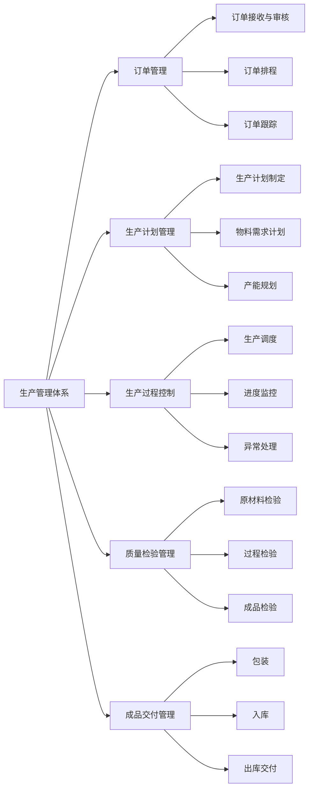

### 2.2 铝合金门窗生产工艺流程

铝合金门窗的生产工艺流程是确保产品质量的核心环节，主要分为以下几个阶段：

#### 2.2.1 基础工艺流程

```
框扇断料 → 框扇铣口 → 铣锁孔槽 → 钻五金孔 → 切玻璃压条 → 
装框扇密封胶条 → 装玻璃压条 → 扇玻组合 → 装五金配件 → 
检验 → 包装 → 入库
```

#### 2.2.2 详细工艺流程说明

**第一阶段：型材准备**
- 框扇断料：根据设计图纸和订单要求，使用精密切割设备将铝型材切割成所需长度，公差控制在±0.5mm以内
- 型材清洁：去除型材表面的油污、灰尘等杂质
- 型材检验：检查型材外观质量、尺寸精度和表面处理质量

**第二阶段：机械加工**
- 框扇铣口：使用铣床对框扇连接部位进行45度或90度角铣削
- 铣锁孔槽：根据五金件规格要求，在指定位置铣削锁孔和安装槽
- 钻五金孔：使用钻孔设备在相应位置钻制五金件安装孔
- 切玻璃压条：根据玻璃尺寸要求切割压条

**第三阶段：组装工艺**
- 装框扇密封胶条：在框扇的密封槽内安装三元乙丙橡胶密封条
- 装玻璃压条：将玻璃压条安装在框架上
- 扇玻组合：将玻璃扇与框架进行组装
- 双角码注胶处理：在每个45度角进行双组份注胶处理，防止渗水

**第四阶段：成品组装**
- 装五金配件：安装把手、锁具、合页等五金配件
- 调试与校正：调整门窗的开合灵活性，确保启闭顺畅
- 整体检验：对外观、尺寸、功能进行综合检验

**第五阶段：包装与入库**
- 清洁表面：清除加工过程中的污渍和划痕
- 保护包装：使用珍珠棉、护角等材料进行防护包装
- 标识：贴产品标签，注明产品型号、规格、生产日期等信息
- 入库：按分类存放在仓库指定位置

#### 2.2.3 断桥铝门窗特殊工艺

断桥铝门窗需要在普通铝合金门窗的基础上增加隔热桥处理：

```
断桥铝型材准备 → 滚压隔热条 → 切割加工 → 注胶组角 → 穿条工艺 → 
后续组装工序
```

### 2.3 生产设备配置

铝合金门窗加工厂需要配备以下主要设备：

| 设备类别 | 设备名称 | 主要功能 | 技术要求 |
|---------|---------|---------|---------|
| 切割设备 | 双头切割锯 | 型材定长切割 | 切割精度±0.1mm |
| | 组角机 | 45度组角 | 组角强度≥1500N |
| 铣削设备 | 端面铣床 | 端面铣削加工 | 铣削精度±0.05mm |
| | 锁孔铣床 | 锁孔槽铣削 | 定位精度±0.1mm |
| 钻孔设备 | 多头钻床 | 批量钻孔 | 钻孔精度±0.1mm |
| | 数控加工中心 | 复杂加工 | 多轴联动 |
| 组装设备 | 组角机 | 框扇组角 | 自动化程度高 |
| | 玻璃压条机 | 玻璃压条安装 | 压紧力可调 |
| 检测设备 | 尺寸检测仪 | 尺寸测量 | 精度0.01mm |
| | 水密性测试仪 | 水密性测试 | 符合国家标准 |

### 2.4 生产计划与调度

#### 2.4.1 生产计划制定流程

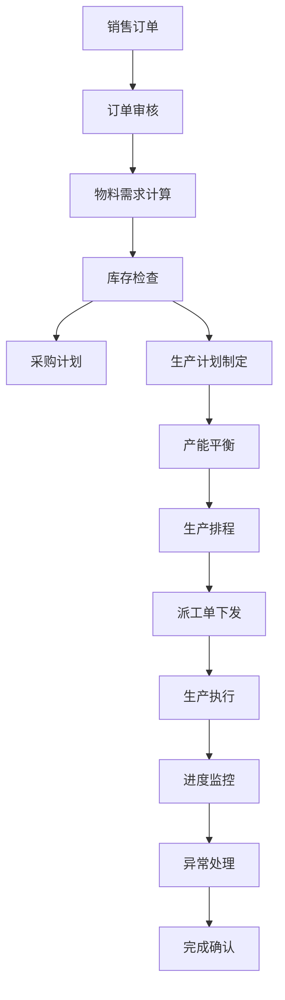

#### 2.4.2 生产调度原则

1. 优先级原则：紧急订单优先、大客户订单优先、标准产品优先
2. 成本优化原则：合理安排生产顺序，减少设备空转和换线时间
3. 质量优先原则：确保每道工序质量合格后才能转入下道工序
4. 柔性生产原则：根据订单变化及时调整生产计划

---

## 三、经营管理模式

### 3.1 组织架构

铝合金门窗加工厂的组织架构通常采用直线职能制或事业部制：

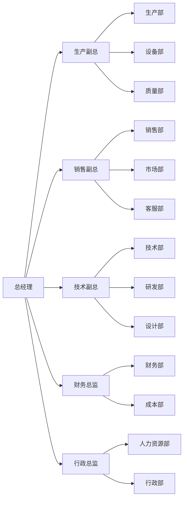

### 3.2 部门职能

#### 3.2.1 生产部门职能

- **生产部主管**：从技术经营部取得各项图纸，认真分析并提出发现的问题；复核技术经营部的各项提料单并签发；复核技术经营部的各项下料单，签发并以此安排生产；做好生产进度控制和质量控制
- **生产计划**：制定详细的生产计划，考虑订单数量、交付日期等因素，合理安排生产任务
- **车间管理**：负责车间现场管理、人员调度、设备维护等

#### 3.2.2 技术经营部门职能

- **技术设计**：负责产品设计、工艺编制、技术支持
- **订单处理**：接收订单、审核订单、编制生产任务书
- **物料计划**：编制物料需求计划、提料单、下料单

#### 3.2.3 质量部门职能

- **质量检验**：原材料检验、过程检验、成品检验
- **质量控制**：建立质量管理体系、制定质量标准、实施质量控制
- **质量改进**：分析质量问题、制定改进措施、跟踪改进效果

### 3.3 管理模式类型

#### 3.3.1 刚性管理模式

刚性管理要求中小铝合金门窗企业着力通过硬性的、统一的制度和标准创造相对公平的环境，完善对员工的制约机制，强力改变那些根深蒂固的行为方式和习惯。主要特点包括：

- 制度化管理：建立完善的规章制度和操作规范
- 标准化作业：制定标准作业程序（SOP）
- 目标考核：设定明确的量化考核指标
- 纪律约束：严格执行各项纪律规定

#### 3.3.2 柔性管理模式

柔性管理强调以人为本，注重激发员工的主动性和创造性。主要特点包括：

- 文化建设：培育企业文化，增强员工归属感
- 沟通机制：建立畅通的沟通渠道
- 激励机制：设计多元化的激励方案
- 参与管理：鼓励员工参与管理决策

#### 3.3.3 混合管理模式

大多数铝合金门窗企业采用刚性管理与柔性管理相结合的混合模式，在制度规范的基础上，注重人文关怀和员工激励。

### 3.4 信息化管理

现代铝合金门窗加工厂广泛应用信息化管理系统：

#### 3.4.1 ERP系统

企业资源计划（ERP）系统是铝合金门窗企业信息化管理的核心，主要功能包括：

- **订单管理**：订单接收、审核、跟踪
- **生产管理**：生产计划、生产调度、进度监控
- **采购管理**：供应商管理、采购订单、采购跟踪
- **库存管理**：入库、出库、盘点、预警
- **财务管理**：应收应付、成本核算、财务报表
- **客户管理**：客户档案、合同管理、售后服务

#### 3.4.2 专用门窗管理软件

针对门窗行业特点开发的专用管理软件，如杜特M3门窗ERP管理软件，具有以下特点：

- 行业化功能：针对门窗行业的特殊需求设计
- 流程优化：整合门窗行业最佳实践
- 数据集成：实现业务数据的无缝集成
- 移动应用：支持手机APP，实现移动办公

---

## 四、质量控制体系

### 4.1 质量管理体系架构

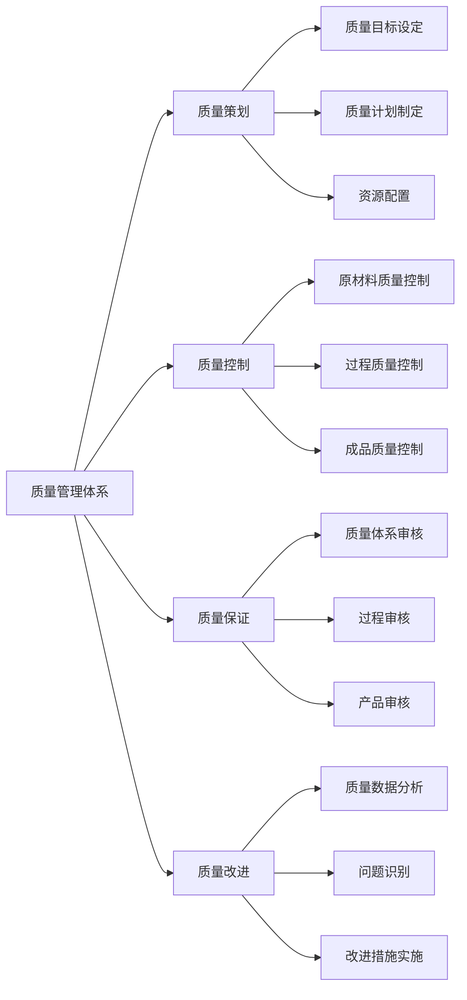

### 4.2 国家标准与行业标准

铝合金门窗行业的主要国家标准和行业标准：

#### 4.2.1 国家标准

- **GB/T 8478-2020《铝合金门窗》**：规定了铝合金门窗的分类和标记、要求、试验方法、检验规则、产品标志及随行文件、包装、运输和贮存
- **GB/T 5237《铝合金建筑型材》**：规定了铝合金建筑型材的技术要求、试验方法、检验规则等
- **GB/T 42407-2023《门窗智能控制系统通用技术要求》**：规定了门窗智能控制系统的技术要求

#### 4.2.2 行业标准

- **JG/T 458-2014《建筑门窗自动控制系统通用技术要求》**
- **DB37/T 1345-2009《铝门窗组角机通用技术条件》**

### 4.3 质量控制要点

#### 4.3.1 原材料质量控制

**铝合金型材质量控制**：
- 外观质量：表面平整、无划痕、无氧化膜脱落
- 尺寸精度：符合GB/T 5237标准要求
- 力学性能：抗拉强度、屈服强度、伸长率符合要求
- 表面处理：阳极氧化、电泳涂装、粉末喷涂质量合格

**玻璃质量控制**：
- 玻璃品种：浮法玻璃、着色玻璃、镀膜玻璃、中空玻璃、钢化玻璃、夹层玻璃等符合设计要求
- 厚度公差：符合相关标准
- 边缘处理：边缘光滑、无崩边
- 中空玻璃：密封性能、露点符合要求

**五金配件质量控制**：
- 材质：不锈钢、铝合金等符合要求
- 表面处理：镀锌、镀铬等处理质量合格
- 功能性能：启闭灵活、锁紧可靠
- 耐久性：使用寿命符合要求

**密封胶条质量控制**：
- 材质：三元乙丙橡胶（EPDM）等符合要求
- 硬度：邵氏硬度符合设计要求
- 耐候性：耐老化性能良好
- 回弹性：弹性回复性能良好

#### 4.3.2 过程质量控制

**切割工序质量控制**：
- 切割长度公差：±0.5mm
- 切割角度：90°±0.5°，45°±0.5°
- 切割面质量：无毛刺、无崩边

**铣削工序质量控制**：
- 铣削尺寸公差：±0.1mm
- 铣削表面质量：光滑、无刀痕
- 定位精度：±0.1mm

**钻孔工序质量控制**：
- 孔径公差：±0.1mm
- 孔位公差：±0.2mm
- 孔深公差：±0.5mm

**组角工序质量控制**：
- 组角角度：90°±0.5°
- 组角强度：≥1500N
- 注胶质量：胶缝饱满、无气泡

**组装工序质量控制**：
- 对角线长度差：≤2mm
- 框扇间隙：均匀一致
- 五金件安装：牢固、位置准确

#### 4.3.3 成品质量控制

**外观质量**：
- 表面光洁、无划痕、无色差
- 玻璃无破损、无划伤
- 五金件安装牢固、无松动

**尺寸精度**：
- 宽度公差：±1.5mm
- 高度公差：±1.5mm
- 对角线长度差：≤3mm

**性能检测**：
- 抗风压性能：符合设计要求
- 气密性：符合设计要求
- 水密性：符合设计要求
- 保温性能：符合设计要求
- 隔声性能：符合设计要求

### 4.4 质量检验流程

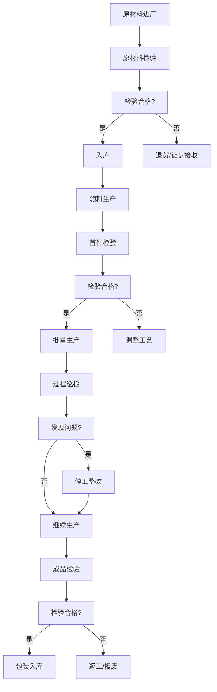

### 4.5 质量管理工具

#### 4.5.1 统计过程控制（SPC）

通过统计方法监控生产过程，及时发现异常波动：

- 控制图：监控关键参数的稳定性
- 过程能力指数（Cp、Cpk）：评估过程能力
- 帕累托图：分析质量问题的主要因素

#### 4.5.2 全面质量管理（TQM）

推行全员参与的质量管理理念：

- 质量教育：提高全员质量意识
- QC小组：开展质量改进活动
- 质量成本管理：降低质量损失

#### 4.5.3 ISO质量管理体系

建立符合ISO 9001标准的质量管理体系：

- 文件化管理：建立完善的质量管理体系文件
- 过程方法：识别和管理质量管理体系过程
- 持续改进：通过内部审核和管理评审持续改进

---

## 五、成本控制与财务管理

### 5.1 成本构成分析

铝合金门窗的全成本费用主要由以下几部分组成：

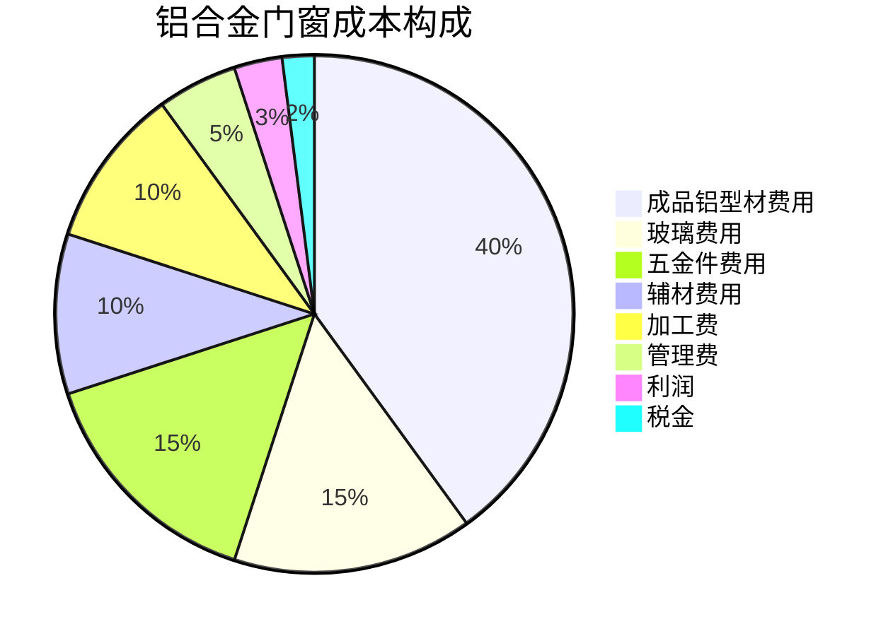

#### 5.1.1 直接材料成本

**成品铝型材费用**：
- 铝锭价格：受国际铝价波动影响
- 加工费：型材挤压、表面处理费用
- 供应价构成：铝锭价 + 加工费 + 利润 + 税金

**玻璃费用**：
- 玻璃原片成本
- 深加工费用（钢化、中空、镀膜等）
- 运输费用

**五金件费用**：
- 五金件采购成本
- 五金件种类和质量等级影响较大

**辅材费用**：
- 密封胶条
- 硅酮玻璃胶
- 螺丝、铆钉等紧固件
- 包装材料

#### 5.1.2 直接人工成本

- 生产工人工资
- 计件工资或计时工资
- 加班费
- 社保公积金

#### 5.1.3 制造费用

- 设备折旧
- 厂房折旧或租金
- 水电费
- 维修保养费
- 模具费用

#### 5.1.4 期间费用

- 销售费用
- 管理费用
- 财务费用

### 5.2 成本控制要点

#### 5.2.1 材料成本控制

**铝型材成本控制**：
- 优化排料方案，提高材料利用率
- 与供应商建立战略合作，获取优惠价格
- 关注铝价走势，合理安排采购时机
- 减少型材库存，降低资金占用

**玻璃成本控制**：

- 优化玻璃规格，减少玻璃损耗
- 集中采购，获取批量优惠
- 选择合适玻璃品种，避免过度配置

**五金件成本控制**：

- 标准化五金件，降低采购成本
- 集中采购，降低采购价格
- 优化五金件配置，避免冗余

#### 5.2.2 生产成本控制

**提高生产效率**：

- 优化生产工艺，减少生产工序
- 提高设备自动化程度，降低人工成本
- 改善生产布局，减少物料搬运

**降低废品率**：

- 加强质量控制，减少返工和报废
- 提高工人操作技能
- 改善工艺条件

**降低能耗**：

- 更新节能设备
- 优化生产计划，减少设备空转
- 合理安排生产班次

#### 5.2.3 管理成本控制

**精简管理机构**：

- 优化组织结构，减少管理层级
- 推行扁平化管理，提高管理效率

**降低管理费用**：
- 控制办公费用
- 优化会议管理，提高会议效率
- 推行无纸化办公

### 5.3 财务管理体系

#### 5.3.1 财务管理流程

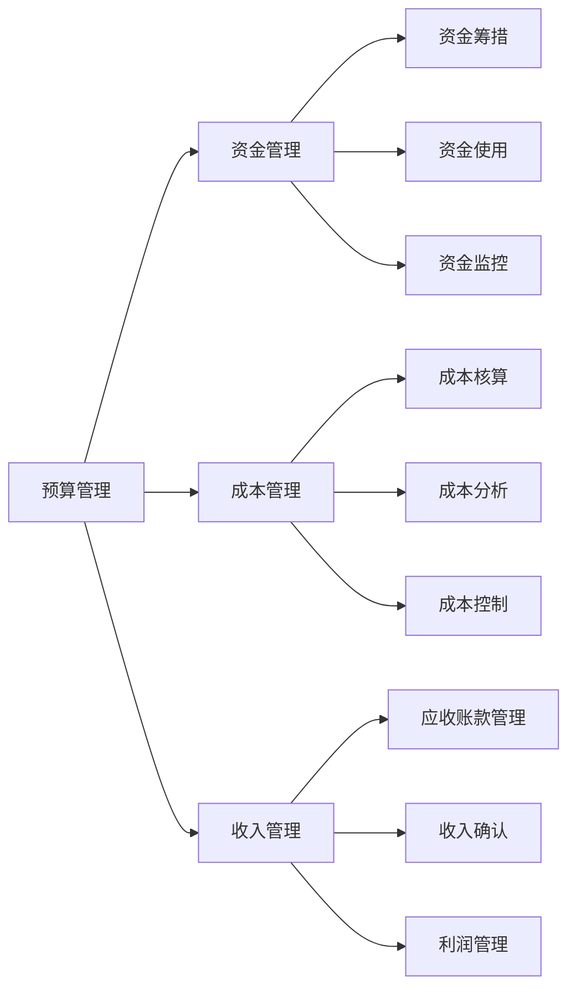

#### 5.3.2 成本核算方法

**标准成本法**：
- 制定标准成本
- 记录实际成本
- 计算成本差异
- 分析差异原因

**作业成本法**：
- 识别作业
- 归集作业成本
- 分配作业成本到产品
- 计算产品成本

#### 5.3.3 财务报表分析

**主要财务指标**：

| 指标类别 | 指标名称 | 计算公式 | 目标值 |
|---------|---------|---------|-------|
| 盈利能力 | 毛利率 | （销售收入-销售成本）/销售收入 | ≥20% |
| | 净利率 | 净利润/销售收入 | ≥5% |
| 偿债能力 | 流动比率 | 流动资产/流动负债 | ≥1.5 |
| | 资产负债率 | 负债总额/资产总额 | ≤60% |
| 运营能力 | 存货周转率 | 销售成本/平均存货余额 | ≥4次/年 |
| | 应收账款周转率 | 销售收入/平均应收账款余额 | ≥6次/年 |

### 5.4 定价策略

#### 5.4.1 成本加成定价法

```
销售价格 = 产品成本 × （1 + 成本利润率）/ （1 - 税率）
```

其中：
- 产品成本 = 直接材料 + 直接人工 + 制造费用
- 成本利润率：根据行业水平和企业目标确定
- 税率：增值税率、附加税率等

#### 5.4.2 市场导向定价法

根据市场需求和竞争情况确定价格：
- 参考竞争对手价格
- 考虑产品差异化程度
- 考虑客户价值认知

#### 5.4.3 价值定价法

根据产品为客户创造的价值确定价格：
- 分析产品为客户带来的价值
- 评估客户愿意支付的价格
- 确定能够实现的价值分享比例

### 5.5 财务信息化管理

应用财务管理软件实现财务管理的数字化：

- **账务处理**：自动化记账、凭证生成、报表编制
- **成本核算**：自动计算产品成本、成本差异分析
- **预算管理**：预算编制、预算执行、预算分析
- **资金管理**：资金计划、资金调度、资金监控

---

## 六、市场营销与客户管理

### 6.1 市场营销体系架构

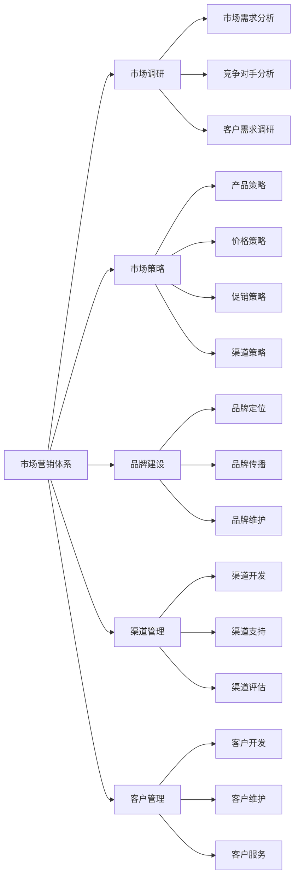

### 6.2 目标市场分析

#### 6.2.1 市场细分

**按应用领域细分**：
- 住宅门窗：新建住宅、旧房改造
- 商业建筑：写字楼、商场、酒店
- 工业建筑：厂房、仓库
- 公共建筑：学校、医院、政府机关

**按客户类型细分**：
- 房地产开发商：批量采购，价格敏感度高
- 装饰公司：中批量采购，注重质量和服务
- 终端业主：零星采购，注重品牌和服务
- 政府项目：公开招标，注重合规性

#### 6.2.2 客户需求分析

**产品质量需求**：
- 抗风压性能
- 气密性、水密性
- 保温性能
- 隔声性能
- 耐久性

**产品功能需求**：
- 开启方式：平开、推拉、上悬等
- 玻璃配置：普通玻璃、中空玻璃、Low-E玻璃等
- 五金件配置：把手、锁具、合页等
- 安全性能：防盗、防爆等

**服务需求**：
- 设计服务
- 测量服务
- 安装服务
- 售后服务
- 维保服务

### 6.3 营销策略

#### 6.3.1 产品策略

**产品线规划**：
- 基础产品线：满足基本需求，价格亲民
- 标准产品线：性能适中，性价比高
- 高端产品线：性能卓越，价格较高
- 定制产品线：满足特殊需求

**产品差异化**：
- 性能差异化：提高产品性能指标
- 功能差异化：增加智能化功能
- 外观差异化：提供多种颜色和风格
- 服务差异化：提供增值服务

#### 6.3.2 价格策略

**定价方法**：
- 成本加成定价
- 竞争导向定价
- 价值导向定价

**价格策略**：
- 撇脂定价：新产品上市初期高价
- 渗透定价：低价快速占领市场
- 差别定价：不同客户不同价格
- 组合定价：产品捆绑销售

#### 6.3.3 促销策略

**广告宣传**：
- 传统媒体：电视、报纸、杂志
- 新媒体：微信、抖音、今日头条
- 行业媒体：专业网站、行业期刊
- 户外广告：高速公路、建材市场

**销售促进**：
- 折扣优惠：批量折扣、现金折扣
- 促销活动：新品上市、节假日促销
- 赠品活动：购买赠送小礼品
- 联合促销：与其他品牌联合推广

**公共关系**：
- 媒体报道：参加行业活动、发布新闻稿
- 社会责任：参与公益活动
- 行业地位：参加行业协会、制定行业标准

#### 6.3.4 渠道策略

**销售渠道类型**：
- 直销渠道：厂家直接销售给终端客户
- 经销商渠道：通过经销商销售
- 专卖店渠道：厂家或经销商开设专卖店
- 建材市场：在建材市场设立展销点
- 工程渠道：参与工程项目投标

**渠道管理**：
- 渠道开发：寻找合适渠道合作伙伴
- 渠道支持：提供培训、营销支持、技术支持
- 渠道激励：制定激励政策，提高渠道积极性
- 渠道评估：定期评估渠道表现，优化渠道结构

### 6.4 客户关系管理（CRM）

#### 6.4.1 客户档案管理

建立完善的客户档案，记录客户信息：

**客户基本信息**：
- 客户名称
- 联系方式
- 客户类型
- 客户等级

**业务信息**：
- 历史订单
- 产品偏好
- 价格接受度
- 付款情况

**服务信息**：
- 服务记录
- 投诉记录
- 满意度评价

#### 6.4.2 客户分级管理

根据客户价值进行分级，制定差异化服务策略：

| 客户等级 | 客户特征 | 服务策略 |
|---------|---------|---------|
| 核心客户 | 采购量大、合作时间长、付款及时 | 专人服务、价格优惠、优先供货 |
| 重点客户 | 采购量较大、有发展潜力 | 定期拜访、技术支持、适度优惠 |
| 一般客户 | 采购量一般、合作关系稳定 | 标准服务、正常价格 |
| 潜在客户 | 有采购意向、尚未合作 | 积极跟进、提供样品、争取合作 |

#### 6.4.3 客户服务

**售前服务**：
- 产品咨询
- 方案设计
- 报价服务
- 样品提供

**售中服务**：
- 订单跟踪
- 生产进度反馈
- 物流协调
- 交货确认

**售后服务**：
- 安装指导
- 质量投诉处理
- 维修服务
- 定期回访

#### 6.4.4 客户满意度管理

**客户满意度调查**：
- 定期开展客户满意度调查
- 收集客户意见和建议
- 分析满意度影响因素

**客户投诉处理**：
- 建立投诉处理流程
- 及时响应客户投诉
- 分析投诉原因，制定改进措施

**客户忠诚度管理**：
- 建立客户忠诚度计划
- 提供增值服务
- 维护客户关系

---

## 七、人力资源管理

### 7.1 人力资源管理体系架构

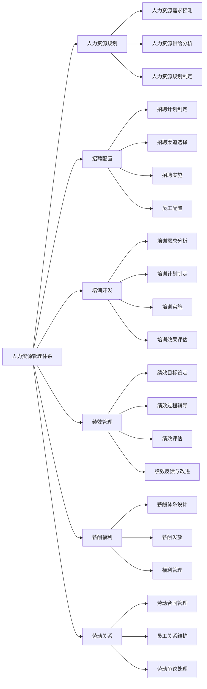

### 7.2 组织岗位设置

#### 7.2.1 管理岗位

| 岗位名称 | 岗位职责 | 任职要求 |
|---------|---------|---------|
| 总经理 | 全面负责公司经营管理 | 大专以上学历，5年以上行业经验 |
| 生产副总 | 负责生产运营管理 | 大专以上学历，3年以上生产管理经验 |
| 销售副总 | 负责销售业务管理 | 大专以上学历，3年以上销售管理经验 |
| 技术副总 | 负责技术研发 | 大专以上学历，3年以上技术管理经验 |
| 财务总监 | 负责财务管理 | 大专以上学历，中级会计师以上职称 |

#### 7.2.2 技术岗位

| 岗位名称 | 岗位职责 | 任职要求 |
|---------|---------|---------|
| 设计师 | 产品设计、图纸绘制 | 大专以上学历，熟练使用CAD软件 |
| 工艺员 | 工艺编制、工艺优化 | 大专以上学历，2年以上工艺经验 |
| 质检员 | 质量检验、质量控制 | 高中以上学历，熟悉质量标准 |

#### 7.2.3 生产岗位

| 岗位名称 | 岗位职责 | 任职要求 |
|---------|---------|---------|
| 操作工 | 设备操作、产品加工 | 初中以上学历，经过培训 |
| 组装工 | 产品组装、五金安装 | 初中以上学历，经过培训 |
| 包装工 | 产品包装、入库 | 初中以上学历，经过培训 |

#### 7.2.4 销售岗位

| 岗位名称 | 岗位职责 | 任职要求 |
|---------|---------|---------|
| 销售经理 | 客户开发、销售管理 | 大专以上学历，2年以上销售经验 |
| 销售代表 | 客户开发、产品销售 | 高中以上学历，沟通能力强 |
| 客服专员 | 客户服务、订单处理 | 高中以上学历，服务意识强 |

### 7.3 招聘与配置

#### 7.3.1 招聘流程

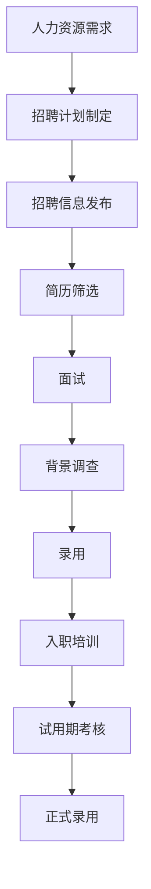

#### 7.3.2 招聘渠道

**内部招聘**：
- 内部晋升
- 内部调动
- 员工推荐

**外部招聘**：
- 网络招聘：招聘网站、社交媒体
- 现场招聘：人才市场、招聘会
- 校园招聘：大专院校、职业院校
- 猎头招聘：高端人才

#### 7.3.3 员工配置

**配置原则**：
- 人岗匹配：根据岗位要求配置合适人员
- 能级对应：根据能力大小配置合适岗位
- 用人之长：发挥员工优势
- 动态调整：根据发展需要调整人员配置

### 7.4 培训与开发

#### 7.4.1 培训体系

**新员工培训**：
- 企业文化培训
- 规章制度培训
- 岗位技能培训
- 安全培训

**在职培训**：
- 岗位技能提升培训
- 管理技能培训
- 新技术新工艺培训
- 质量管理培训

**外送培训**：
- 专业技能培训
- 管理培训
- 学历提升

#### 7.4.2 培训内容

**技术培训**：
- 生产工艺培训
- 设备操作培训
- 质量标准培训
- 安全操作培训

**管理培训**：
- 生产管理培训
- 质量管理培训
- 现场管理培训（5S/6S）
- 班组管理培训

**技能培训**：
- 设备维修技能
- 质量检验技能
- 设计绘图技能
- 销售技巧

#### 7.4.3 培训方法

**在职培训**：
- 师带徒：经验丰富的员工指导新员工
- 岗位轮换：员工在不同岗位轮换学习
- 挂职锻炼：员工到其他部门锻炼

**脱产培训**：
- 内部培训：公司内部组织培训
- 外部培训：参加外部机构培训
- 网络培训：在线学习平台

### 7.5 绩效管理

#### 7.5.1 绩效管理体系

```
绩效目标设定 → 绩效过程辅导 → 绩效评估 → 绩效反馈 → 绩效改进
```

#### 7.5.2 绩效指标

**生产部门绩效指标**：

| 指标类别 | 指标名称 | 目标值 |
|---------|---------|-------|
| 效率指标 | 生产计划完成率 | ≥95% |
| | 设备利用率 | ≥85% |
| | 劳动生产率 | 持续提升 |
| 质量指标 | 产品合格率 | ≥98% |
| | 客户投诉率 | ≤1% |
| 成本指标 | 单位产品成本 | 持续降低 |
| 安全指标 | 安全事故率 | 0 |

**销售部门绩效指标**：

| 指标类别 | 指标名称 | 目标值 |
|---------|---------|-------|
| 销售指标 | 销售收入 | 完成预算 |
| | 销售增长率 | ≥10% |
| 客户指标 | 新客户开发数 | 按计划完成 |
| | 客户满意度 | ≥90% |
| 回款指标 | 应收账款周转率 | ≥6次/年 |

#### 7.5.3 绩效评估方法

**评估周期**：
- 月度评估：日常工作表现
- 季度评估：阶段性工作成果
- 年度评估：年度工作绩效

**评估方法**：
- 目标管理法：根据目标完成情况评估
- 360度评估：上级、同事、下属、客户综合评估
- 关键事件法：根据关键事件评估
- 行为锚定法：根据行为表现评估

#### 7.5.4 绩效结果应用

- 薪酬调整：根据绩效结果调整薪酬
- 晋升提拔：优秀员工优先晋升
- 培训开发：针对性培训提升
- 改进计划：绩效不佳制定改进计划
- 末位淘汰：连续绩效不佳淘汰

### 7.6 薪酬福利管理

#### 7.6.1 薪酬体系

**薪酬结构**：
- 基本工资：固定薪酬
- 绩效工资：根据绩效考核发放
- 津贴补贴：岗位津贴、技能津贴、餐补、交通补贴等
- 奖金：年终奖、项目奖金、销售提成等

**薪酬水平**：
- 市场薪酬调查：了解市场薪酬水平
- 薪酬定位：根据企业战略确定薪酬水平
- 薪酬调整：定期评估调整

#### 7.6.2 福利管理

**法定福利**：
- 社会保险：养老、医疗、失业、工伤、生育保险
- 住房公积金
- 法定假期：年假、婚假、产假等

**企业福利**：
- 带薪年假
- 节日福利
- 生日福利
- 团建活动
- 健康体检
- 员工培训
- 交通补贴
- 餐饮补贴
- 通讯补贴

### 7.7 员工关系管理

#### 7.7.1 劳动合同管理

- 劳动合同签订：员工入职一个月内签订劳动合同
- 合同期限管理：固定期限、无固定期限合同管理
- 合同变更管理：岗位、薪酬、地点等变更
- 合同解除管理：协商解除、单方解除

#### 7.7.2 员工沟通

- 员工大会：定期召开员工大会
- 部门例会：部门内部定期沟通
- 个别谈话：管理者与员工个别沟通
- 意见箱：收集员工意见建议
- 内部网站：内部信息发布平台

#### 7.7.3 企业文化建设

**企业文化建设内容**：
- 企业价值观：明确企业价值观
- 企业精神：提炼企业精神
- 企业愿景：制定企业愿景
- 企业使命：明确企业使命

**企业文化建设途径**：
- 宣传教育：培训、宣传栏、内部刊物
- 活动组织：团建活动、文体活动
- 榜样示范：树立先进典型
- 制度保障：建立保障制度

---

## 八、供应链管理

### 8.1 供应链管理体系架构

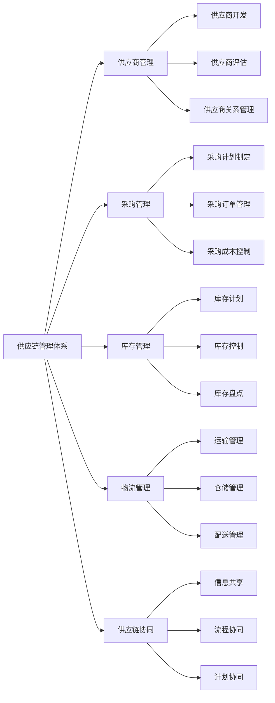

### 8.2 供应商管理

#### 8.2.1 供应商分类

**按物资类别分类**：
- 铝型材供应商：提供铝合金型材
- 玻璃供应商：提供各种玻璃
- 五金件供应商：提供五金配件
- 辅材供应商：提供密封胶条、胶水等辅料
- 包装材料供应商：提供包装材料

**按供应重要性分类**：
- 战略供应商：供应关键物资，对业务影响大
- 优先供应商：供应重要物资，对业务有一定影响
- 一般供应商：供应普通物资，对业务影响较小
- 可选供应商：可有可无的供应商

#### 8.2.2 供应商开发

**供应商开发流程**：

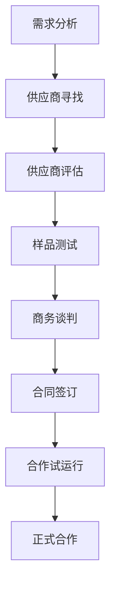

**供应商评估标准**：

| 评估维度 | 评估指标 | 权重 |
|---------|---------|------|
| 质量能力 | 质量体系认证、质量控制能力、产品质量稳定性 | 30% |
| 交付能力 | 交付及时率、交付准确率、交付灵活性 | 25% |
| 价格水平 | 产品价格、付款条件、成本控制能力 | 20% |
| 技术能力 | 技术水平、研发能力、创新能力 | 10% |
| 服务能力 | 售后服务、技术支持、响应速度 | 10% |
| 企业信誉 | 企业规模、财务状况、行业口碑 | 5% |

#### 8.2.3 供应商绩效评估

**评估指标**：

| 指标类别 | 指标名称 | 计算方法 | 目标值 |
|---------|---------|---------|-------|
| 质量指标 | 来料合格率 | 合格批次/总批次 | ≥98% |
| | 质量投诉次数 | 质量投诉次数 | ≤2次/年 |
| 交付指标 | 交付及时率 | 按时交付批次/总批次 | ≥95% |
| | 交付准确率 | 正确交付批次/总批次 | ≥99% |
| 价格指标 | 价格竞争力 | 市场价格对比 | 具有竞争力 |
| 服务指标 | 响应及时性 | 问题响应时间 | ≤24小时 |
| | 问题解决率 | 问题解决数量/问题总数 | ≥95% |

**评估周期**：
- 月度评估：日常绩效跟踪
- 季度评估：阶段性绩效评估
- 年度评估：年度绩效综合评估

**评估结果应用**：
- 优秀供应商：增加采购份额、优先合作
- 良好供应商：维持现有合作
- 一般供应商：减少采购份额、要求改进
- 不合格供应商：暂停合作、重新开发

### 8.3 采购管理

#### 8.3.1 采购流程

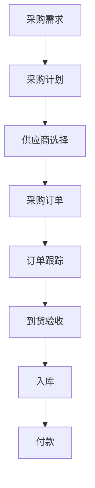

#### 8.3.2 采购计划制定

**采购需求来源**：
- 销售订单驱动：根据销售订单确定采购需求
- 生产计划驱动：根据生产计划确定采购需求
- 库存驱动：根据库存水平确定采购需求
- 预测驱动：根据市场预测确定采购需求

**采购计划内容**：
- 采购物资名称、规格、数量
- 采购时间要求
- 预算金额
- 供应商选择

#### 8.3.3 采购成本控制

**采购成本构成**：
- 物资采购价格
- 运输费用
- 保险费用
- 检验费用
- 仓储费用
- 资金占用成本

**成本控制措施**：
- 集中采购：提高采购规模，降低采购价格
- 批量采购：获得批量折扣
- 长期合作：建立长期合作关系，获得价格优惠
- 价格谈判：与供应商进行价格谈判
- 成本分析：分析采购成本构成，寻找降本空间

### 8.4 库存管理

#### 8.4.1 库存分类

**按物资类别分类**：
- 原材料库存：铝型材、玻璃、五金件等
- 辅材库存：密封胶条、胶水等辅料
- 包装材料库存：包装箱、护角等
- 在制品库存：生产过程中的半成品
- 成品库存：待发货的成品

**按库存价值分类**：
- A类物资：价值高，占库存金额70%左右，品种占10%左右
- B类物资：价值中等，占库存金额20%左右，品种占20%左右
- C类物资：价值低，占库存金额10%左右，品种占70%左右

#### 8.4.2 库存控制方法

**ABC分类法**：
- A类物资：重点控制，精确控制库存水平
- B类物资：一般控制，适度控制库存水平
- C类物资：粗放控制，控制库存总金额

**安全库存法**：
- 确定安全库存水平
- 需求波动时启用安全库存
- 防止缺货

**经济订货批量（EOQ）法**：
- 计算经济订货批量
- 平衡采购成本和库存成本
- 优化订货策略

**JIT（准时制）**：
- 按需采购，降低库存
- 与供应商密切配合
- 实现零库存目标

#### 8.4.3 库存盘点

**盘点方式**：
- 定期盘点：定期进行全面盘点
- 循环盘点：按计划轮流盘点
- 实时盘点：系统实时记录

**盘点流程**：
- 盘点准备：制定盘点计划、培训盘点人员
- 盘点实施：实物清点、数据记录
- 差异分析：分析账实差异原因
- 差异处理：调整账面数据、查找原因

### 8.5 物流管理

#### 8.5.1 运输管理

**运输方式选择**：
- 公路运输：灵活便捷，适合短距离运输
- 铁路运输：成本较低，适合长距离大批量运输
- 水路运输：成本最低，适合国际运输

**运输成本控制**：
- 优化运输路线
- 提高装载率
- 选择合适运输方式
- 与物流公司建立长期合作

#### 8.5.2 仓储管理

**仓库管理内容**：
- 货物入库：验收、入库登记、货位分配
- 货物存储：分类存放、标识清晰、先进先出
- 货物出库：拣货、出库登记、包装
- 库存管理：库存盘点、库存预警

**仓库管理要求**：
- 环境要求：温度、湿度、清洁度
- 安全要求：防火、防盗、防潮
- 空间利用：合理布局、提高空间利用率

---

## 九、安全管理

### 9.1 安全管理体系架构

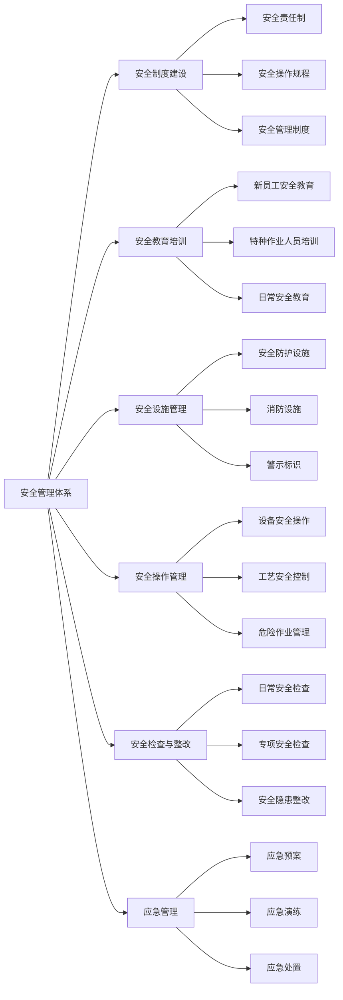

### 9.2 安全制度建设

#### 9.2.1 安全责任制

建立从总经理到一线员工的安全责任制：

- 总经理：全面负责安全生产
- 安全主管：负责安全管理工作
- 部门负责人：负责本部门安全工作
- 班组长：负责本班组安全工作
- 员工：负责本岗位安全工作

#### 9.2.2 安全操作规程

制定各岗位、各设备的安全操作规程：

- 切割设备安全操作规程
- 铣削设备安全操作规程
- 钻孔设备安全操作规程
- 组角设备安全操作规程
- 起重设备安全操作规程

#### 9.2.3 安全管理制度

建立健全安全管理制度：

- 安全教育培训制度
- 安全检查制度
- 事故报告制度
- 劳动防护用品管理制度
- 危险作业审批制度

### 9.3 安全教育培训

#### 9.3.1 新员工安全教育

新员工入职必须经过三级安全教育：

- 厂级安全教育：公司安全制度、安全文化
- 车间级安全教育：车间安全规定、危险因素
- 班组级安全教育：岗位安全操作规程

#### 9.3.2 特种作业人员培训

对特种作业人员进行专门培训：

- 电工：持电工证上岗
- 焊工：持焊工证上岗
- 起重机械操作人员：持操作证上岗
- 厂内机动车辆驾驶员：持驾驶证上岗

#### 9.3.3 日常安全教育

- 班前安全会议：每天开工前召开
- 安全培训：定期开展安全培训
- 安全活动：开展安全月、安全周活动
- 事故案例学习：学习事故案例，吸取教训

### 9.4 安全设施管理

#### 9.4.1 安全防护设施

- 机械设备防护罩
- 安全防护栏
- 安全光栅
- 紧急停止装置
- 安全联锁装置

#### 9.4.2 消防设施

- 灭火器：配置足够数量的灭火器
- 消防栓：配置消防栓和水带
- 消防报警系统：安装消防报警系统
- 疏散通道：保持疏散通道畅通
- 应急照明：配置应急照明

#### 9.4.3 警示标识

- 禁止标识：禁止吸烟、禁止烟火等
- 警告标识：小心触电、小心机械伤害等
- 指令标识：必须戴安全帽、必须穿防护服等
- 提示标识：紧急出口、消防设施等

### 9.5 安全操作管理

#### 9.5.1 设备安全操作

- 严格按照安全操作规程操作设备
- 设备启动前检查设备状态
- 设备运行中注意观察设备运行情况
- 设备故障及时报告并停机
- 设备维护保养时切断电源并挂牌

#### 9.5.2 工艺安全控制

- 严格执行工艺纪律
- 控制工艺参数在安全范围内
- 定期检查工艺设备
- 及时处理工艺异常

#### 9.5.3 危险作业管理

**危险作业类型**：
- 高处作业：2米以上作业
- 动火作业：焊接、切割等明火作业
- 有限空间作业：进入受限空间作业
- 起重作业：使用起重设备作业

**危险作业管理要求**：
- 办理危险作业审批手续
- 制定安全措施
- 配备防护用品
- 设专人监护
- 制定应急预案

### 9.6 安全检查与整改

#### 9.6.1 日常安全检查

- 班组每日安全检查
- 车间每周安全检查
- 公司每月安全检查

#### 9.6.2 专项安全检查

- 节假日安全检查
- 季节性安全检查
- 专项设备安全检查

#### 9.6.3 安全隐患整改

- 隐患识别：通过检查识别安全隐患
- 隐患评估：评估隐患等级
- 隐患整改：制定整改措施并实施
- 整改验收：验收整改效果

### 9.7 应急管理

#### 9.7.1 应急预案

制定各类应急预案：

- 火灾事故应急预案
- 机械伤害事故应急预案
- 触电事故应急预案
- 窒息事故应急预案

#### 9.7.2 应急演练

定期开展应急演练：

- 消防演练
- 疏散演练
- 设备故障应急演练

#### 9.7.3 应急处置

- 事故报告：事故发生后立即报告
- 现场处置：启动应急预案，开展现场处置
- 人员救助：优先救助受伤人员
- 事故调查：调查事故原因
- 事故整改：制定整改措施

---

## 十、信息化与数字化转型

### 10.1 信息化架构

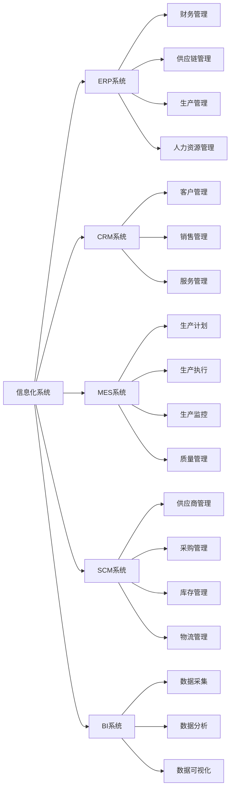

### 10.2 ERP系统应用

#### 10.2.1 核心功能

- 财务管理：总账、应收应付、固定资产、成本核算
- 供应链管理：采购管理、库存管理、销售管理
- 生产管理：生产计划、生产执行、质量管理
- 人力资源管理：人事管理、薪酬管理、绩效管理

#### 10.2.2 实施价值

- 提高管理效率：自动化处理，减少人工操作
- 提高数据准确性：统一数据源，保证数据一致
- 提高决策支持：提供准确及时的数据支持
- 降低运营成本：优化流程，降低运营成本

### 10.3 MES系统应用

#### 10.3.1 核心功能

- 生产计划排程：优化生产计划，提高产能利用率
- 生产过程管理：实时监控生产过程，提高生产透明度
- 质量管理：实时质量检测，提高产品质量
- 设备管理：设备状态监控，提高设备利用率
- 数据采集：自动采集生产数据，提高数据准确性

#### 10.3.2 实施价值

- 提高生产效率：优化生产计划，减少等待时间
- 提高产品质量：实时质量控制，减少质量损失
- 降低生产成本：优化资源配置，降低生产成本
- 提高交货及时率：实时进度监控，确保按时交付

### 10.4 CRM系统应用

#### 10.4.1 核心功能

- 客户管理：客户档案、客户分类、客户分析
- 销售管理：销售机会、销售预测、销售目标
- 服务管理：服务请求、服务派工、服务评价
- 营销管理：营销活动、客户跟进、效果分析

#### 10.4.2 实施价值

- 提高客户满意度：提供更好的服务
- 提高销售效率：优化销售流程
- 提高客户忠诚度：维护客户关系
- 提高营销效果：精准营销

### 10.5 数据分析与商业智能

#### 10.5.1 数据分析应用

- 销售分析：销售趋势、销售结构、客户分析
- 生产分析：生产效率、生产质量、生产成本
- 财务分析：财务指标、成本分析、利润分析
- 供应链分析：库存分析、供应商分析、采购分析

#### 10.5.2 商业智能（BI）

- 数据可视化：通过图表展示数据
- 实时监控：实时监控关键指标
- 预测分析：预测销售趋势、市场需求
- 决策支持：为管理层决策提供支持

---

## 十一、发展趋势与建议

### 11.1 行业发展趋势

#### 11.1.1 产品发展趋势

- 节能环保：推广高性能节能门窗，符合国家节能减排要求
- 智能化：智能门窗、智能控制系统逐渐普及
- 个性化：个性化定制需求增加
- 系统化：门窗系统化、集成化发展

#### 11.1.2 技术发展趋势

- 生产自动化：自动化生产线、机器人应用
- 数字化：数字化设计、数字化制造
- 智能化：智能生产、智能管理
- 绿色化：绿色制造、绿色产品

#### 11.1.3 市场发展趋势

- 市场集中度提高：行业整合加速，龙头企业市场份额提升
- 品牌化发展：品牌价值越来越重要
- 服务化转型：从卖产品向卖服务转型
- 渠道多元化：线上线下融合，渠道多元化发展

### 11.2 管理建议

#### 11.2.1 战略管理建议

- 明确战略定位：明确企业战略定位和目标
- 专注核心业务：专注于核心业务，做精做强
- 创新驱动发展：技术创新、管理创新、商业模式创新
- 建立竞争优势：建立差异化竞争优势

#### 11.2.2 生产管理建议

- 推行精益生产：消除浪费，提高效率
- 推进智能制造：推进生产自动化、数字化、智能化
- 优化生产布局：优化生产布局，提高生产效率
- 提高设备自动化水平：提高设备自动化水平，降低人工成本

#### 11.2.3 质量管理建议

- 建立全面质量管理体系：建立从原材料到成品的全过程质量控制
- 推进标准化工作：建立完善的标准体系
- 加强质量文化建设：培育质量文化，提高全员质量意识
- 持续改进质量：持续改进产品质量和质量管理体系

#### 11.2.4 成本管理建议

- 精细化成本管理：精细化管理各项成本
- 优化产品设计：通过优化设计降低成本
- 提高生产效率：通过提高生产效率降低成本
- 优化供应链：通过优化供应链降低成本

#### 11.2.5 营销管理建议

- 建立品牌：建立企业品牌，提高品牌知名度
- 拓展渠道：拓展销售渠道，提高市场覆盖
- 优化产品结构：优化产品结构，提高盈利能力
- 提升服务水平：提升服务水平，提高客户满意度

#### 11.2.6 人力资源管理建议

- 建立人才梯队：建立各层级人才梯队
- 加强培训：加强员工培训，提高员工能力
- 优化激励机制：优化激励机制，激发员工积极性
- 营造良好氛围：营造良好的企业文化氛围

#### 11.2.7 信息化建设建议

- 制定信息化规划：制定企业信息化发展规划
- 分步实施：分阶段实施信息化项目
- 注重应用效果：注重信息化应用效果
- 持续优化：持续优化信息系统

---

## 十二、结论

铝合金门窗加工厂的经营管理是一个复杂的系统工程，涉及生产管理、经营管理、质量控制、成本控制、市场营销、人力资源管理、供应链管理、安全管理等多个方面。企业要实现可持续发展，必须：

1. 建立完善的管理体系，包括生产管理体系、质量管理体系、成本管理体系等
2. 推进信息化建设，应用ERP、MES、CRM等信息化系统，提高管理效率和水平
3. 注重人才培养，建立完善的人力资源管理体系，培养和吸引优秀人才
4. 持续创新，包括技术创新、管理创新、商业模式创新
5. 建立核心竞争力，在产品质量、成本、服务、品牌等方面建立竞争优势
6. 适应行业发展趋势，推进智能化、数字化、绿色化转型

通过系统化的经营管理，铝合金门窗加工厂可以提高产品质量、降低生产成本、提高管理效率、增强市场竞争力，实现可持续发展。

---

## 附录

### 附录A：主要国家标准和行业标准

| 标准编号 | 标准名称 | 发布日期 |
|---------|---------|---------|
| GB/T 8478-2020 | 铝合金门窗 | 2020-03-31 |
| GB/T 5237.1-2017 | 铝合金建筑型材 第1部分：基材 | 2017-10-14 |
| GB/T 5237.2-2017 | 铝合金建筑型材 第2部分：阳极氧化型材 | 2017-10-14 |
| GB/T 5237.3-2017 | 铝合金建筑型材 第3部分：电泳涂漆型材 | 2017-10-14 |
| GB/T 5237.4-2017 | 铝合金建筑型材 第4部分：喷粉型材 | 2017-10-14 |
| GB/T 5237.5-2017 | 铝合金建筑型材 第5部分：喷漆型材 | 2017-10-14 |
| GB/T 5237.6-2017 | 铝合金建筑型材 第6部分：隔热型材 | 2017-10-14 |
| GB/T 42407-2023 | 门窗智能控制系统通用技术要求 | 2023-05-23 |
| JG/T 458-2014 | 建筑门窗自动控制系统通用技术要求 | 2014-12-01 |
| DB37/T 1345-2009 | 铝门窗组角机通用技术条件 | 2009-03-25 |

### 附录B：主要术语和定义

| 术语 | 定义 |
|-----|------|
| 铝合金门窗 | 采用铝合金建筑型材制作框、扇杆件结构的门窗 |
| 断桥铝门窗 | 在铝合金型材之间设置隔热桥，以提高隔热性能的门窗 |
| 系统门窗 | 按照系统化理念设计、制造、安装的门窗 |
| 节能门窗 | 具有良好保温隔热性能，能够降低建筑能耗的门窗 |
| 智能门窗 | 集成智能控制功能，能够实现远程控制、自动控制的门窗 |
| 组角 | 门窗框、扇的角部连接工艺 |
| 注胶组角 | 在角部注入胶水的组角工艺 |
| 双角码注胶 | 使用两个角码并在角部注入胶水的组角工艺 |

---

**报告编制说明**：

本报告基于对铝合金门窗加工厂经营管理的深入调研，综合了生产管理、经营管理、质量控制、成本控制、市场营销、人力资源管理、供应链管理、安全管理等多个维度的知识体系。报告内容全面系统，既有理论阐述，又有实践指导，可为铝合金门窗加工厂的经营管理者提供参考。

报告编制过程中参考了大量行业标准、技术文献和实践经验，力求内容准确、实用。但由于铝合金门窗行业在不断发展变化，报告内容可能需要根据实际情况进行调整和完善。

---

**报告编制日期**：2026年3月25日

**报告适用范围**：铝合金门窗加工厂经营管理

**报告使用说明**：本报告可作为铝合金门窗加工厂经营管理的参考和指导，企业可根据自身实际情况进行调整和应用。